# Notas Proyecto Integrador


## 01-PI-Papp-Turina   🚀

El modelo propuesto para el desarrollo del trabajo es el **modelo iterativo**. En cada iteración se presentará:

1. Planteo de los **objetivos** que se esperan alcanzar al finalizar la iteración.
2. Propuesta de un nuevo **modelo de redes de Petri** y/o modificaciones al anterior para cubrir los objetivos propuestos.
3. **Explicación detallada** del funcionamiento del modelo propuesto.
4. **Validación** del modelo.
5. **Implementación** del modelo.
6. **Análisis final** en base a los objetivos planteados al inicio de la iteración y los resultados obtenidos.
7. **Pasos a seguir** en la próxima iteración.

---


### Primera iteración: Modelo Inicial 📋

_En base a los 5 estados que se puede encontrar un hilo se obtiene:_


<p align="center">
  <a href="https://example.com/">
    
  </a>
  </p>

**T0**:  Momento de creación de un proceso o cuando el mismo realiza un fork. Esta tarea no corresponde al scheduler, por lo que inicialmente un hilo en el scheduler se encuentra inicializado en el estado `CAN RUN`. Esta transición nunca se dispara, solo se la incorpora al modelo de modo representativo.

**T1**: El hilo se pone en una cola local de una determinada CPU o en la cola global dependiendo de la disponibilidad. Esta cola organiza los hilos de acuerdo a sus prioridades de ejecución.

**T2**: El hilo pasa de la cola ejecutando las instrucciones del programa que tiene asignadas. En este instante el procesador se encuentra ocupado por dicho hilo.

**T3**: El scheduler interrumpe el hilo y lo vuelve a colocar en una cola. El planificador toma otro hilo de la cola (el de mayor prioridad) y realiza un cambio de contexto.

**T4**: Algún evento, semáforo o espera bloquea al hilo. Se agrega en una `sleepq` o `turnstile`, en la cual el hilo queda a la espera de un evento que le quitará el bloqueo.

**T5**: Se desbloquea el hilo y puede volver a encolarse nuevamente. El evento que lo desbloquea se genera fuera del scheduler. El hilo queda a la espera para poder cambiar de estado cuando corresponda.

### ¿En qué parte se define la estructura de los hilos?

`\sys\sys\proc.h`  → Se puede observar

_NOTA: Algunos valores presentan incongruencias, ya que corresponden a la versión final de la RDP. Por motivos de continuidad, se muestra que se han modificado, pero no se debe dar importancia al valor final. En la última versión se aclarará este punto._

<p align="center">
  <a href="https://example.com/">
    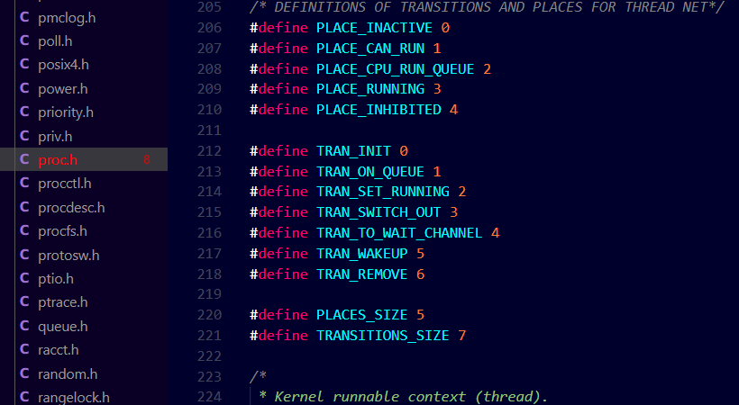
  </a>
  </p>

  Agregar a la estructura `thread` los siguientes campos:

- `mark`: vector que tiene el marcado inicial, con tamaño `PLACES SIZE`.
- `sensitized_buffer`: vector que representa las transiciones sensibilizadas de su red asociada, con tamaño `TRANSITIONS SIZE`.


<p align="center">
  <a href="https://example.com/">
    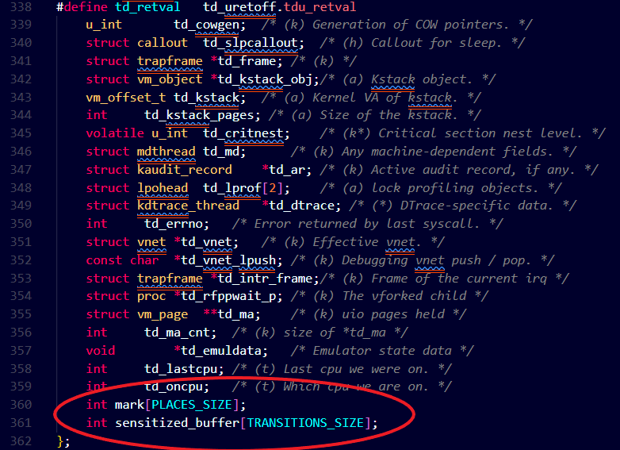
  </a>
  </p>


  `\sys\kern\sched_petri.c`  → Se creo que incluye a sched_petri.h para
representar la red de Petri propuesta y su funcionamiento. Se declaración
la matriz de incidencia (PLACES SIZE * TRANSITIONS SIZE) y el vector
de marcado inicial (PLACES SIZE), y a su vez se implementaron las
funciones declaradas anteriormente:

<p align="center">
  <a href="https://example.com/">
    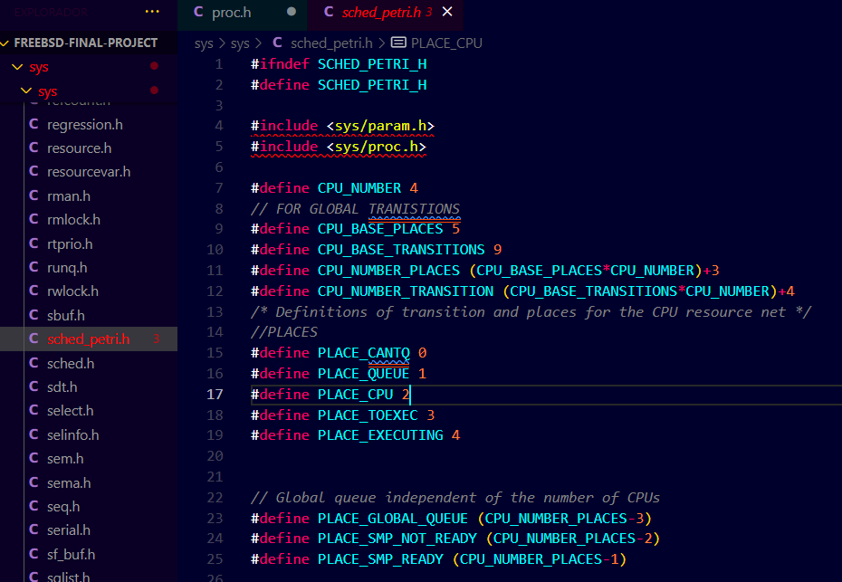
  </a>
  </p>


### ¿Donde se inicializa y asigna memoria a la estructura thread dentro del código fuente?

`\sys\kern\kern_thread.c`  → Llamamos ahora a `init_petri_net` para inicializar y asignar memoria

<p align="center">
  <a href="https://example.com/">
    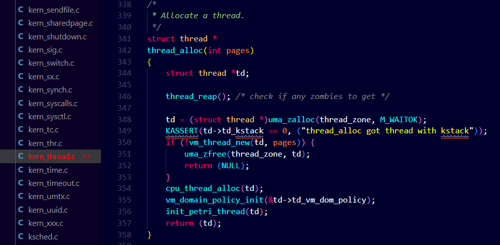
  </a>
  </p>

### Conclusion: Primera Interacción

Con un modelo ya desarrollado para los hilos, el próximo paso consiste en
proponer un modelo inicial para representar los estados y eventos de los recursos del sistema.

---


### Segunda iteración: Recursos del sistema 📋

En esta iteración se buscara proponer un modelo inicial de red de Petri para representar el reparto de las CPU para cada uno de los hilos.

<p align="center">
  <a href="https://example.com/">
    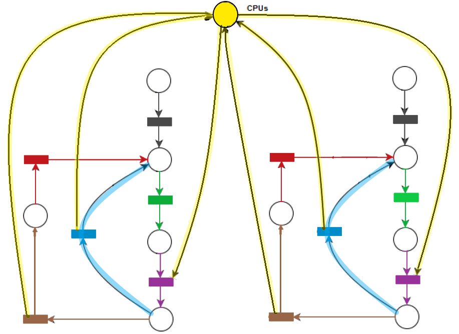
  </a>
  </p>


---


### Tercera iteración: Sistema de turnos  para 4 CPU. 📋

Se pensó la red como el ciclo de un token que circula por
tantas plazas como CPU disponga el sistema. Esto nos da la posibilidad de ir
tomando decisiones respecto a cada CPU y de poder movernos de una CPU a
la siguiente en forma cíclica, pasando por todas las CPU antes de volver a la
misma. Esto permite que la asignación de hilos dentro de cada CPU sea justa
y equitativa.

<p align="center">
  <a href="https://example.com/">
    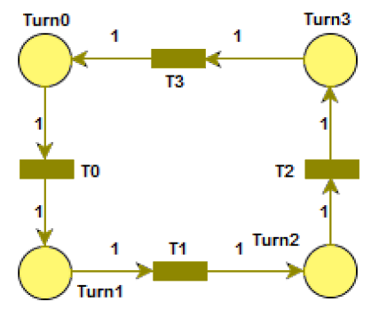
  </a>
  </p>


### ¿Cómo represento los CPU en la RdP?

`\sys\sys\sched_petri.h` se describen ahi 

<p align="center">
  <a href="https://example.com/">
    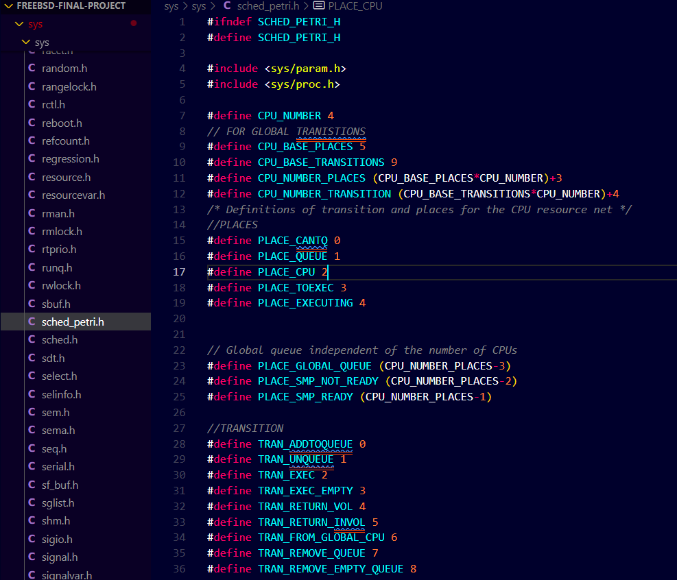
  </a>
  </p>


### ¿Cómo represento los recursos GLOBALES en la RdP?

`sys\kern\petri_global_net.c` → representar la red de Petri de recursos propuesta y su funcionamiento.
Se declaro la matriz de incidencia base y la matriz de inhibición base, y a
su vez se implementaron las funciones declaradas anteriormente

<p align="center">
  <a href="https://example.com/">
    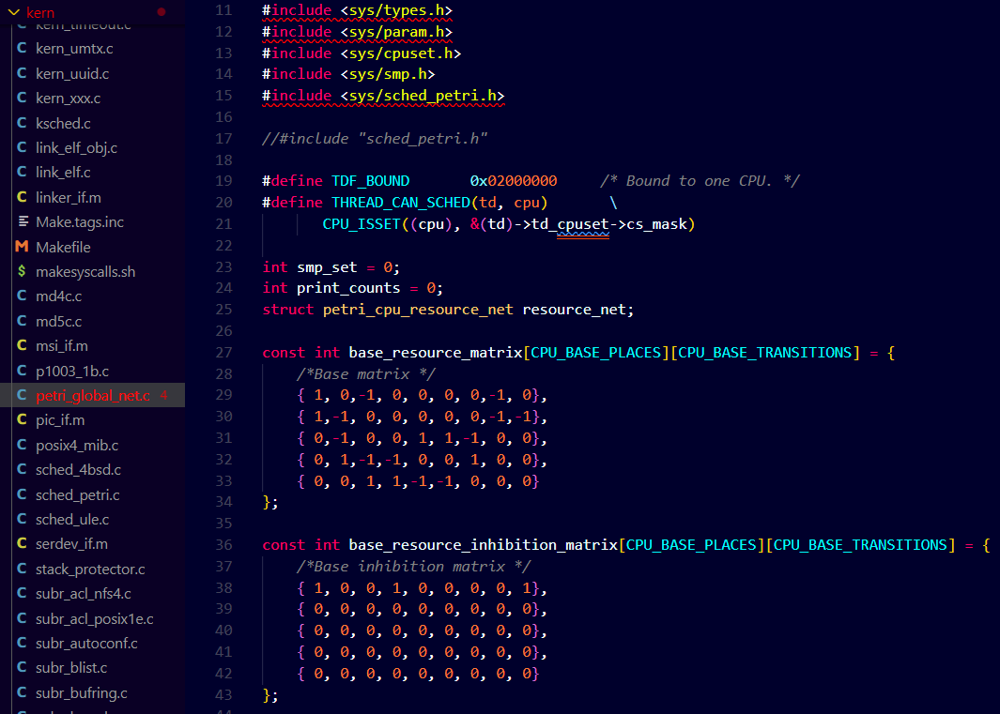
  </a>
  </p>


### ¿Qué más se ha añadido en la Tercera intersección?

En la función sched_setup del archivo sched_4bsd.c identificar donde
se inicializa el scheduler para inicializar su red de recursos. Llamar a init_resource_net en sched_setup para inicializar y asignar
espacio de memoria para la red de recursos.

<p align="center">
  <a href="https://example.com/">
    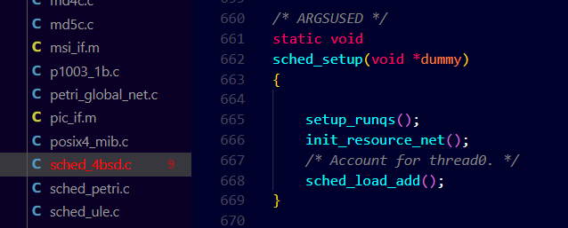
  </a>
  </p>


---


### Cuarta iteración: Encolado. 📋

Encolado equitativo de hilos en las diferentes
CPU que conforman el sistema.


<p align="center">
  <a href="https://example.com/">
    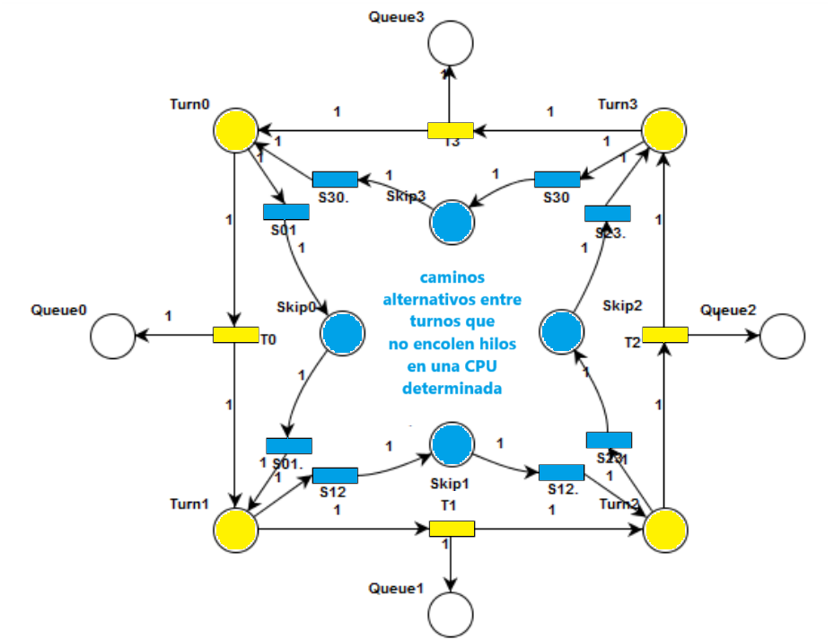
  </a>
  </p>

- Que la CPU este en condiciones de encolar: se disparara una transicion que pase el turno y agregue un token a la cola de esa CPU.

- Que la CPU no este en condiciones de encolar: se disparara una transicion
que pasara el turno al siguiente sin agregar tokens en su cola.


Para implementar el modelo en el código fuente, se procedió a:

### ¿Donde se realiza el encolado de threads en el código fuente?

Esto se realiza en `sched_4bsd.c` en la función `sched_add`.

<p align="center">
  <a href="https://example.com/">
    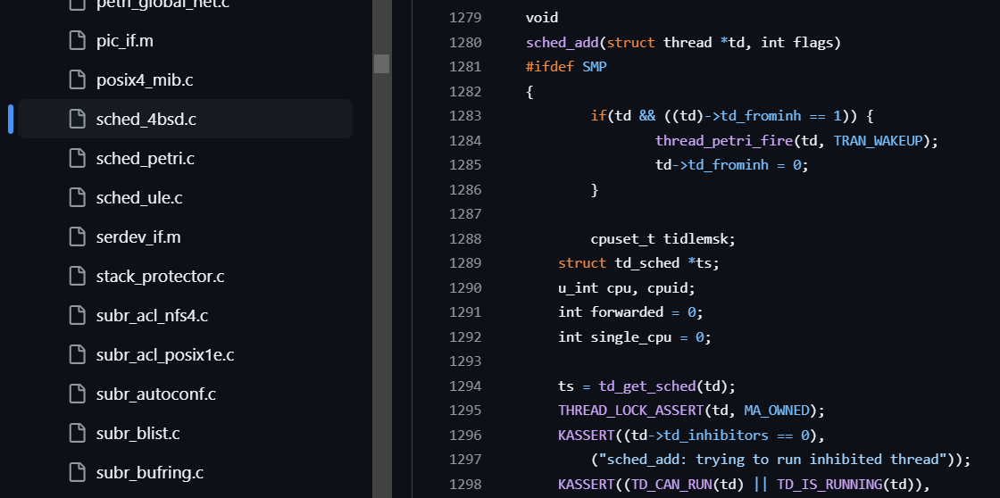
  </a>
  </p>

 Llamar a `resource_fire_net` en `sched_add` para contemplar en la red el encolado de los threads que ingresan al scheduler en la CPU que le corresponda.

<p align="center">
  <a href="https://example.com/">
    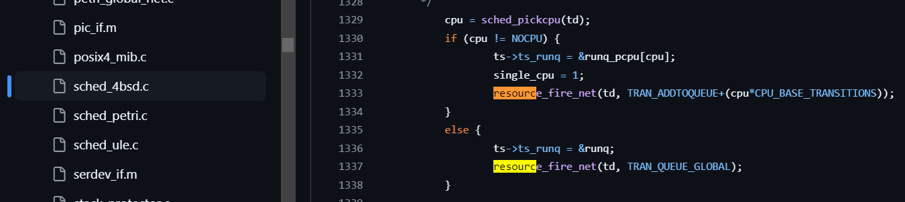
  </a>
  </p>


### Quinta iteración: Encolado Controlado. 📋

Sistema de autocontrol para las asignaciones de los hilos que permita determinar cuales son las
CPU que tienen la mayor cantidad de hilos en sus colas y de esta forma decidir
si la CPU actual esta en condiciones de encolar.


<p align="center">
  <a href="https://example.com/">
    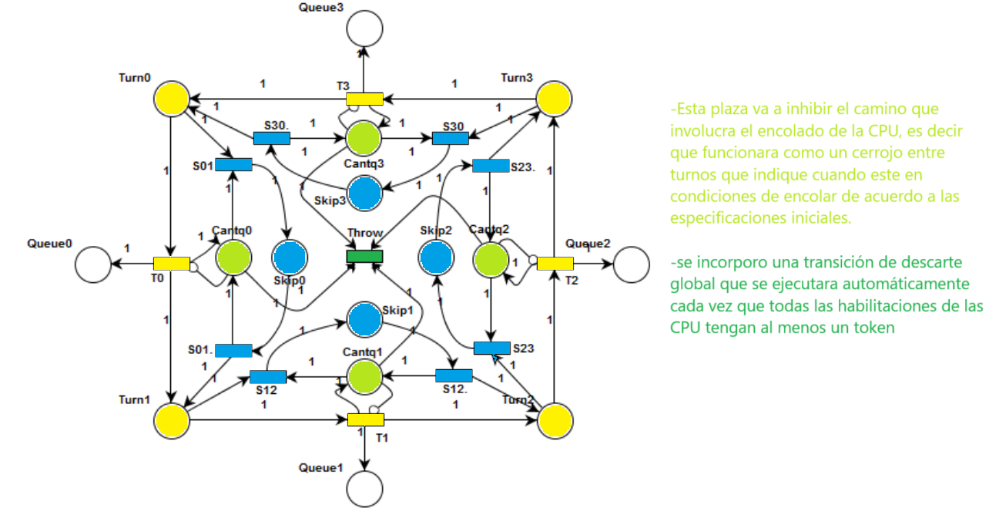
  </a>
  </p>

  ### Implementación


Definir como automática la transición de descarte al momento de inicializar el vector de transiciones automáticas en `sched_petri.h`. De esta forma, cada vez que la misma quede sensibilizada, será disparada de inmediato, manteniendo siempre así en el modelo al menos una CPU que pueda encolar.

<p align="center">
  <a href="https://example.com/">
    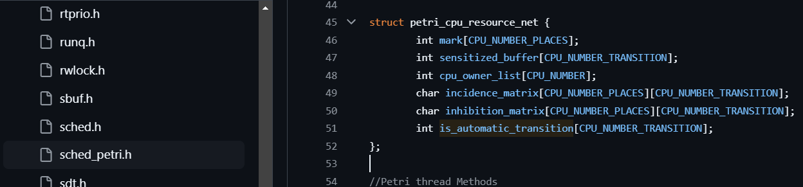
  </a>
  </p>


  ### Sexta iteración: Selección y Ejecución del Hilo. 📋

  Modelo para el encolado y desencolado de hilos. Las transiciones en naranja van a representar al resto de las
CPU y se las incorporan al modelo para mostrar la penalizaci´on detallada

<p align="center">
  <a href="https://example.com/">
    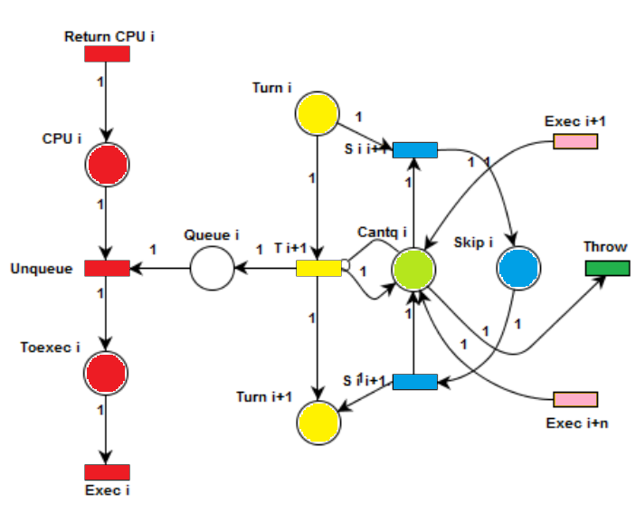
  </a>
  </p>

  ### Implementación

1. Agregar en `petri_global_net.c` dos vectores:
   - `Hierarchical_transitions`: vector con las transiciones jerárquicas de la red de recursos, ordenadas de acuerdo al índice correspondiente con `hierarchical_corresponse`.
   - `Hierarchical_corresponse`: vector con las transiciones jerárquicas de la red del thread, ordenadas de acuerdo al índice correspondiente con `hierarchical_transitions`.

<p align="center">
  <a href="https://example.com/">
    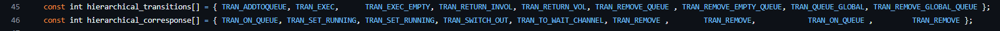
  </a>
  </p>

2. Llamar a `resource_fire_net` en `sched_switch` para contemplar en la red los threads que pasan a ejecución en la CPU que le corresponda.

3. Identificar dónde finaliza la ejecución de los threads liberando la CPU en el código fuente. Esto se realiza en `sched_4bsd.c` en `sched_switch`.

4. Llamar a `resource_fire_net` en `sched_switch` para contemplar en la red los threads que finalizan su ejecución y retornan la CPU que corresponde.

5. Incorporar en `petri_global_net.c` en la función `resource_fire_net` el disparo de las transiciones jerárquicas de la red del thread cuando una transición de la red de recursos que le corresponda se dispara.

6. Identificar dónde se realiza el desencolado de threads en el código fuente. Esto se realiza en `sched_4bsd.c` en la función `sched_choose`.

7. Llamar a `resource_fire_net` en `sched_choose` para contemplar en la red el desencolado de los threads que van a pasar a ejecución en la CPU que le corresponda.

8. Identificar dónde se manda a ejecutar a los threads en el código fuente. Esto se realiza en `sched_4bsd.c` en la función `sched_switch`.


---

Continuando con el análisis, se llevó a cabo un análisis más minucioso del modelo planteando la siguiente cuestión:

- ¿Es necesario llevar un sistema de turnos por cada CPU?
- ¿No sería más eficiente que directamente se sensibilicen las transiciones de encolado cuyas colas estén habilitadas?

---

### Septima iteración: Modelo sin turnos. 📋

El sistema de turnos propuesto
desde un principio resulta innecesario e ineficiente

<p align="center">
  <a href="https://example.com/">
    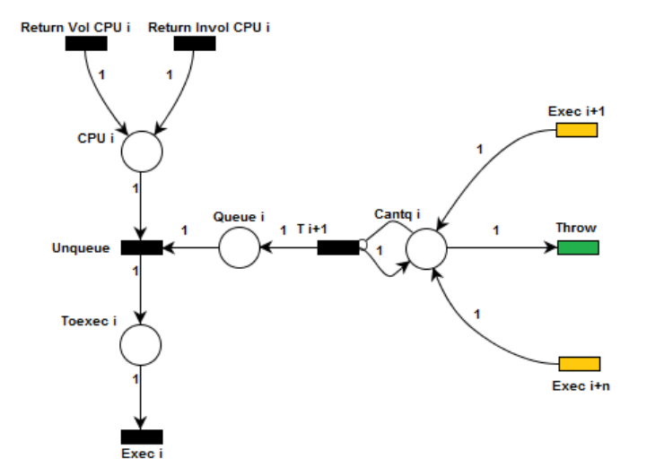
  </a>
  </p>

  #### Analogía entre Estados de hilos y Recursos

  Como se puede observar, la mayoría de las transiciones de la red de Petri de un hilo pueden vincularse a la red de recursos. Sin embargo, es necesario realizar algunas aclaraciones:

1. Las últimas dos transiciones detalladas anteriormente generan un retorno de la CPU en la red de recursos. Es necesario categorizar el retorno en:
   - **Voluntario**: cuando la interrupción de la ejecución se debe a que el hilo no puede continuar porque espera por un evento o un recurso.
   - **Involuntario**: cuando la interrupción se produce porque el hilo consumió su tiempo asignado de CPU o bien finalizó su tarea. Para distinguir entre ambos retornos, se incluirán dos transiciones diferentes para representarlas en el modelo.

2. La transición `INACTIVE ⇒ CAN RUN` del hilo no es tarea del scheduler, por lo que la misma no tiene jerarquía en la red de recursos.

3. La transición `INHIBITED ⇒ CAN RUN` del hilo tampoco depende del scheduler y no tiene jerarquía con la red de recursos. Esta transición depende de otras partes del sistema operativo que se encargan de generar los eventos o liberar los recursos que necesita el hilo. Por este motivo, esta transición solo va a monitorear cuando se produzca esto último para disparar en ese momento esta transición previo a disparar la de encolado.


<p align="center">
  <a href="https://example.com/">
    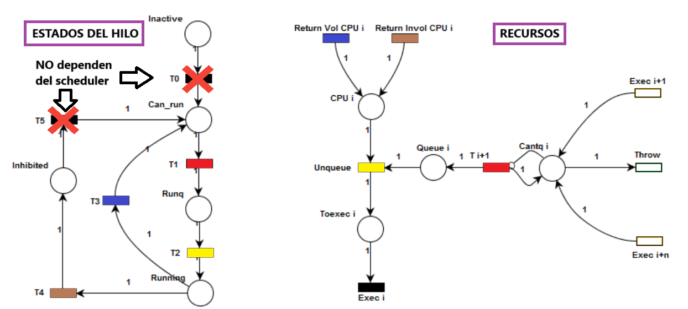
  </a>
  </p>


Al momento de tener que encolar un hilo en una cola de CPU, el scheduler se encarga de llevar a cabo un monitoreo general de todas las transiciones de encolado de la red de recursos para determinar cuáles de estas se encuentran sensibilizadas en ese momento y, entre las mismas, seleccionar una para disparar. Considerando este comportamiento, la simplificación propuesta en la iteración anterior se considera factible para el modelo.


#### Implementación del modelo


1. Dividir en `petri_global_net.c` las transiciones jerárquicas de cambio de contexto.
2. Agregar en `sched_petri.h` la definición de `resource_choose_cpu` e implementarla en `petri_global_net.c`:
   - `resource_choose_cpu`: recibe un thread como parámetro, busca la transición de encolado de la CPU que esté disponible y la retorna.
3. Agregar en la función `sched_add` de `sched_4bsd.c` un llamado a la función `resource_choose_cpu` antes de realizar el encolado para tener la CPU correcta.
4. Añadir a la estructura `thread` en `proc.h` el campo `td_frominh` que va a indicar cuando un thread acaba de salir de estado inhibido. Esto ocurre cuando el mismo pasa por un cambio de contexto voluntario.
5. Agregar en `sched_petri.h` la definición de `resource_expulse_thread` e implementarla en `petri_global_net.c`:
   - `resource_expulse_thread`: recibe un thread como parámetro y las flags de cambio de contexto. Según el tipo de cambio de contexto, actualiza el valor de `td_frominh` y dispara la transición de retorno de CPU correspondiente en la red de recursos y, por ende, su jerárquica.
6. Llamar a `resource_expulse_thread` en lugar de `resource_fire_net` en `sched_switch` para contemplar en la red los threads que finalizan su ejecución.
7. Disparar la transición del thread que lo saca del estado de inhibido en la función `sched_add` de `sched_4bsd.c`.

---

### Octava iteración: Afinidad de hilos. 📋

Supuesto de que los hilos pueden tener cierta afinidad con alguna CPU o grupo de CPU, se buscará modelar el caso en el que ninguna CPU afín a un hilo que está por ser encolado se encuentre disponible. Se implementará una nueva **cola general para todas las CPU**, donde serán encolados los hilos que no tienen ninguna de sus CPU afines disponibles.


<p align="center">
  <a href="https://example.com/">
    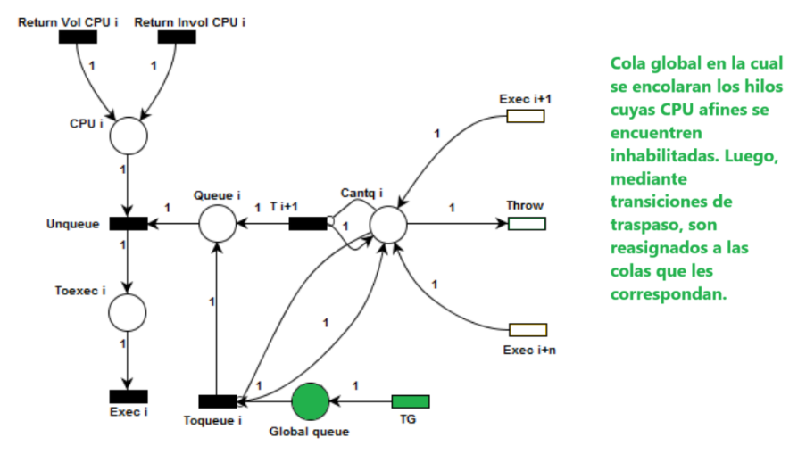
  </a>
  </p>


#### Implementación del modelo


1. Añadir en `petri_global_net.c` la transición jerárquica del thread a la transición de encolado global.
2. Analizar en la función `resource_choose_cpu` en `petri_global_net.c` las flags que indican las CPU afines a un thread y, en base a esto, tomar la decisión de retornar una cola de CPU o bien la cola global.
3. Tener en cuenta en la función `sched_add` de `sched_4bsd.c` la nueva transición de encolado global, disparándola cuando no se retorna ninguna CPU donde encolar.

```
¿¿¿ Colas deshabilitadas ???

Se descubrió que, al momento de inicializarse el sistema operativo, las colas de las CPU se encuentran deshabilitadas hasta que todas las CPU son inicializadas, encontrándose solo la CPU0 disponible desde el inicio. Esto podría presentar un problema para el encolado de hilos, pero se determinó que la cola global añadida al modelo podría también ser utilizada para encolar a todos los hilos hasta que las colas de las CPU se encuentren disponibles. De esta forma, va a ser necesario plantearse en las próximas iteraciones una forma de representar esta situación de inicio.

Continuando el análisis, también se presentó otra cuestión. A la hora de seleccionar el próximo hilo a ejecutar por una CPU, el scheduler pregunta tanto a la cola global como a la cola de la CPU cuál es el hilo con mayor prioridad para pasarlo directamente a ejecución. En base a este funcionamiento, resulta innecesario realizar el cambio de cola propuesto anteriormente; en su lugar, resulta más factible pasar el hilo presente en la cola global directamente a ejecución.
```


---

###  Novena iteración: Selección entre colas 📋

<p align="center">
  <a href="https://example.com/">
    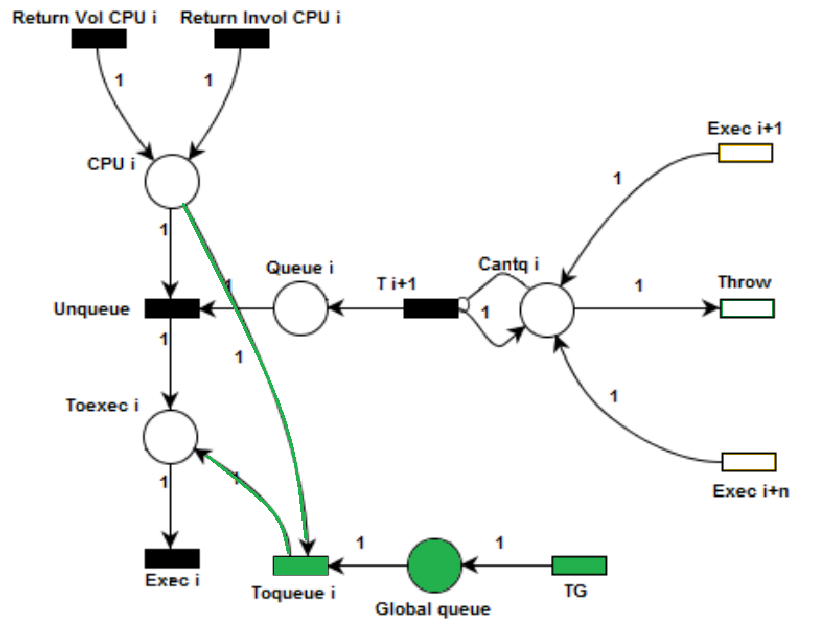
  </a>
  </p>

  Los hilos presentes en la cola global son tenidos en cuenta al momento en que una CPU elige el próximo hilo a ejecutar. Esta transición, que ahora también se corresponderá a una transición de desencolado, tendrá como jerárquica del hilo a `RUNQ ⇒ RUNNING`.


El hecho de que un hilo se encuentre en la cola propia de la CPU o bien en la cola global no influye en la decisión sobre el próximo a ser ejecutado. 

#### Cambios de contexto en base al modelo obtenido

En esta iteración, también se estudió con mayor profundidad el funcionamiento de los cambios de contexto en base al modelo obtenido. Cuando se produce un cambio de contexto, es decir, que el hilo que está en ejecución libera la CPU y se lo cede al de mayor prioridad de la cola, se produce la siguiente secuencia:

1. El hilo en ejecución es expulsado, retornando la CPU y cambiando su estado de `RUNNING ⇒ CAN RUN/INHIBITED`.
2. El hilo saliente es agregado a una cola de ejecución en caso de que sea un cambio de contexto involuntario, cambiando de estado de `CAN RUN ⇒ RUNQ`.
3. Se elige el siguiente hilo a ejecutar y se lo manda a ejecución, asignándole la CPU y cambiando su estado de `RUNQ ⇒ RUNNING`.
