# Notas Proyecto Integrador


# 01-PI-Papp-Turina   🚀

El modelo propuesto para el desarrollo del trabajo es el **modelo iterativo**. En cada iteración se presentará:

1. Planteo de los **objetivos** que se esperan alcanzar al finalizar la iteración.
2. Propuesta de un nuevo **modelo de redes de Petri** y/o modificaciones al anterior para cubrir los objetivos propuestos.
3. **Explicación detallada** del funcionamiento del modelo propuesto.
4. **Validación** del modelo.
5. **Implementación** del modelo.
6. **Análisis final** en base a los objetivos planteados al inicio de la iteración y los resultados obtenidos.
7. **Pasos a seguir** en la próxima iteración.

---


### Primera iteración: Modelo Inicial 📋

_En base a los 5 estados que se puede encontrar un hilo se obtiene:_


<p align="center">
    
  </a>
  </p>

**T0**:  Momento de creación de un proceso o cuando el mismo realiza un fork. Esta tarea no corresponde al scheduler, por lo que inicialmente un hilo en el scheduler se encuentra inicializado en el estado `CAN RUN`. Esta transición nunca se dispara, solo se la incorpora al modelo de modo representativo.

**T1**: El hilo se pone en una cola local de una determinada CPU o en la cola global dependiendo de la disponibilidad. Esta cola organiza los hilos de acuerdo a sus prioridades de ejecución.

**T2**: El hilo pasa de la cola ejecutando las instrucciones del programa que tiene asignadas. En este instante el procesador se encuentra ocupado por dicho hilo.

**T3**: El scheduler interrumpe el hilo y lo vuelve a colocar en una cola. El planificador toma otro hilo de la cola (el de mayor prioridad) y realiza un cambio de contexto.

**T4**: Algún evento, semáforo o espera bloquea al hilo. Se agrega en una `sleepq` o `turnstile`, en la cual el hilo queda a la espera de un evento que le quitará el bloqueo.

**T5**: Se desbloquea el hilo y puede volver a encolarse nuevamente. El evento que lo desbloquea se genera fuera del scheduler. El hilo queda a la espera para poder cambiar de estado cuando corresponda.

### ¿En qué parte se define la estructura de los hilos?

`\sys\sys\proc.h`  → Se puede observar

_NOTA: Algunos valores presentan incongruencias, ya que corresponden a la versión final de la RDP. Por motivos de continuidad, se muestra que se han modificado, pero no se debe dar importancia al valor final. En la última versión se aclarará este punto._

<p align="center">
    
  </a>
  </p>

  Agregar a la estructura `thread` los siguientes campos:

- `mark`: vector que tiene el marcado inicial, con tamaño `PLACES SIZE`.
- `sensitized_buffer`: vector que representa las transiciones sensibilizadas de su red asociada, con tamaño `TRANSITIONS SIZE`.


<p align="center">
    
  </a>
  </p>


  `\sys\kern\sched_petri.c`  → Se creo que incluye a sched_petri.h para
representar la red de Petri propuesta y su funcionamiento. Se declaración
la matriz de incidencia (PLACES SIZE * TRANSITIONS SIZE) y el vector
de marcado inicial (PLACES SIZE), y a su vez se implementaron las
funciones declaradas anteriormente:

<p align="center">
    
  </a>
  </p>


### ¿Donde se inicializa y asigna memoria a la estructura thread dentro del código fuente?

`\sys\kern\kern_thread.c`  → Llamamos ahora a `init_petri_net` para inicializar y asignar memoria

<p align="center">
    
  </a>
  </p>

### Conclusion: Primera Interacción

Con un modelo ya desarrollado para los hilos, el próximo paso consiste en
proponer un modelo inicial para representar los estados y eventos de los recursos del sistema.

---


### Segunda iteración: Recursos del sistema 📋

En esta iteración se buscara proponer un modelo inicial de red de Petri para representar el reparto de las CPU para cada uno de los hilos.

<p align="center">
    
  </a>
  </p>


---


### Tercera iteración: Sistema de turnos  para 4 CPU. 📋

Se pensó la red como el ciclo de un token que circula por
tantas plazas como CPU disponga el sistema. Esto nos da la posibilidad de ir
tomando decisiones respecto a cada CPU y de poder movernos de una CPU a
la siguiente en forma cíclica, pasando por todas las CPU antes de volver a la
misma. Esto permite que la asignación de hilos dentro de cada CPU sea justa
y equitativa.

<p align="center">
    
  </a>
  </p>


### ¿Cómo represento los CPU en la RdP?

`\sys\sys\sched_petri.h` se describen ahi 

<p align="center">
    
  </a>
  </p>


### ¿Cómo represento los recursos GLOBALES en la RdP?

`sys\kern\petri_global_net.c` → representar la red de Petri de recursos propuesta y su funcionamiento.
Se declaro la matriz de incidencia base y la matriz de inhibición base, y a
su vez se implementaron las funciones declaradas anteriormente

<p align="center">
    
  </a>
  </p>


### ¿Qué más se ha añadido en la Tercera intersección?

En la función sched_setup del archivo sched_4bsd.c identificar donde
se inicializa el scheduler para inicializar su red de recursos. Llamar a init_resource_net en sched_setup para inicializar y asignar
espacio de memoria para la red de recursos.

<p align="center">
    
  </a>
  </p>


---


### Cuarta iteración: Encolado. 📋

Encolado equitativo de hilos en las diferentes
CPU que conforman el sistema.


<p align="center">
    
  </a>
  </p>

- Que la CPU este en condiciones de encolar: se disparara una transicion que pase el turno y agregue un token a la cola de esa CPU.

- Que la CPU no este en condiciones de encolar: se disparara una transicion
que pasara el turno al siguiente sin agregar tokens en su cola.


Para implementar el modelo en el código fuente, se procedió a:

### ¿Donde se realiza el encolado de threads en el código fuente?

Esto se realiza en `sched_4bsd.c` en la función `sched_add`.

<p align="center">
    
  </a>
  </p>

 Llamar a `resource_fire_net` en `sched_add` para contemplar en la red el encolado de los threads que ingresan al scheduler en la CPU que le corresponda.

<p align="center">
    
  </a>
  </p>


### Quinta iteración: Encolado Controlado. 📋

Sistema de autocontrol para las asignaciones de los hilos que permita determinar cuales son las
CPU que tienen la mayor cantidad de hilos en sus colas y de esta forma decidir
si la CPU actual esta en condiciones de encolar.


<p align="center">
    
  </a>
  </p>

  ### Implementación


Definir como automática la transición de descarte al momento de inicializar el vector de transiciones automáticas en `sched_petri.h`. De esta forma, cada vez que la misma quede sensibilizada, será disparada de inmediato, manteniendo siempre así en el modelo al menos una CPU que pueda encolar.

<p align="center">
    
  </a>
  </p>


  ### Sexta iteración: Selección y Ejecución del Hilo. 📋

  Modelo para el encolado y desencolado de hilos. Las transiciones en naranja van a representar al resto de las
CPU y se las incorporan al modelo para mostrar la penalización detallada

<p align="center">
    
  </a>
  </p>

  ### Implementación

1. Agregar en `petri_global_net.c` dos vectores:
   - `Hierarchical_transitions`: vector con las transiciones jerárquicas de la red de recursos, ordenadas de acuerdo al índice correspondiente con `hierarchical_corresponse`.
   - `Hierarchical_corresponse`: vector con las transiciones jerárquicas de la red del thread, ordenadas de acuerdo al índice correspondiente con `hierarchical_transitions`.

<p align="center">
    
  </a>
  </p>

2. Llamar a `resource_fire_net` en `sched_switch` para contemplar en la red los threads que pasan a ejecución en la CPU que le corresponda.

3. Identificar dónde finaliza la ejecución de los threads liberando la CPU en el código fuente. Esto se realiza en `sched_4bsd.c` en `sched_switch`.

4. Llamar a `resource_fire_net` en `sched_switch` para contemplar en la red los threads que finalizan su ejecución y retornan la CPU que corresponde.

5. Incorporar en `petri_global_net.c` en la función `resource_fire_net` el disparo de las transiciones jerárquicas de la red del thread cuando una transición de la red de recursos que le corresponda se dispara.

6. Identificar dónde se realiza el desencolado de threads en el código fuente. Esto se realiza en `sched_4bsd.c` en la función `sched_choose`.

7. Llamar a `resource_fire_net` en `sched_choose` para contemplar en la red el desencolado de los threads que van a pasar a ejecución en la CPU que le corresponda.

8. Identificar dónde se manda a ejecutar a los threads en el código fuente. Esto se realiza en `sched_4bsd.c` en la función `sched_switch`.


---

Continuando con el análisis, se llevó a cabo un análisis más minucioso del modelo planteando la siguiente cuestión:

- ¿Es necesario llevar un sistema de turnos por cada CPU?
- ¿No sería más eficiente que directamente se sensibilicen las transiciones de encolado cuyas colas estén habilitadas?

---

### Septima iteración: Modelo sin turnos. 📋

El sistema de turnos propuesto
desde un principio resulta innecesario e ineficiente

<p align="center">
    
  </a>
  </p>

  #### Analogía entre Estados de hilos y Recursos

  Como se puede observar, la mayoría de las transiciones de la red de Petri de un hilo pueden vincularse a la red de recursos. Sin embargo, es necesario realizar algunas aclaraciones:

1. Las últimas dos transiciones detalladas anteriormente generan un retorno de la CPU en la red de recursos. Es necesario categorizar el retorno en:
   - **Voluntario**: cuando la interrupción de la ejecución se debe a que el hilo no puede continuar porque espera por un evento o un recurso.
   - **Involuntario**: cuando la interrupción se produce porque el hilo consumió su tiempo asignado de CPU o bien finalizó su tarea. Para distinguir entre ambos retornos, se incluirán dos transiciones diferentes para representarlas en el modelo.

2. La transición `INACTIVE ⇒ CAN RUN` del hilo no es tarea del scheduler, por lo que la misma no tiene jerarquía en la red de recursos.

3. La transición `INHIBITED ⇒ CAN RUN` del hilo tampoco depende del scheduler y no tiene jerarquía con la red de recursos. Esta transición depende de otras partes del sistema operativo que se encargan de generar los eventos o liberar los recursos que necesita el hilo. Por este motivo, esta transición solo va a monitorear cuando se produzca esto último para disparar en ese momento esta transición previo a disparar la de encolado.


<p align="center">
    
  </a>
  </p>


Al momento de tener que encolar un hilo en una cola de CPU, el scheduler se encarga de llevar a cabo un monitoreo general de todas las transiciones de encolado de la red de recursos para determinar cuáles de estas se encuentran sensibilizadas en ese momento y, entre las mismas, seleccionar una para disparar. Considerando este comportamiento, la simplificación propuesta en la iteración anterior se considera factible para el modelo.


#### Implementación del modelo


1. Dividir en `petri_global_net.c` las transiciones jerárquicas de cambio de contexto.
2. Agregar en `sched_petri.h` la definición de `resource_choose_cpu` e implementarla en `petri_global_net.c`:
   - `resource_choose_cpu`: recibe un thread como parámetro, busca la transición de encolado de la CPU que esté disponible y la retorna.
3. Agregar en la función `sched_add` de `sched_4bsd.c` un llamado a la función `resource_choose_cpu` antes de realizar el encolado para tener la CPU correcta.
4. Añadir a la estructura `thread` en `proc.h` el campo `td_frominh` que va a indicar cuando un thread acaba de salir de estado inhibido. Esto ocurre cuando el mismo pasa por un cambio de contexto voluntario.
5. Agregar en `sched_petri.h` la definición de `resource_expulse_thread` e implementarla en `petri_global_net.c`:
   - `resource_expulse_thread`: recibe un thread como parámetro y las flags de cambio de contexto. Según el tipo de cambio de contexto, actualiza el valor de `td_frominh` y dispara la transición de retorno de CPU correspondiente en la red de recursos y, por ende, su jerárquica.
6. Llamar a `resource_expulse_thread` en lugar de `resource_fire_net` en `sched_switch` para contemplar en la red los threads que finalizan su ejecución.
7. Disparar la transición del thread que lo saca del estado de inhibido en la función `sched_add` de `sched_4bsd.c`.

---

### Octava iteración: Afinidad de hilos. 📋

Supuesto de que los hilos pueden tener cierta afinidad con alguna CPU o grupo de CPU, se buscará modelar el caso en el que ninguna CPU afín a un hilo que está por ser encolado se encuentre disponible. Se implementará una nueva **cola general para todas las CPU**, donde serán encolados los hilos que no tienen ninguna de sus CPU afines disponibles.


<p align="center">
    
  </a>
  </p>


#### Implementación del modelo


1. Añadir en `petri_global_net.c` la transición jerárquica del thread a la transición de encolado global.
2. Analizar en la función `resource_choose_cpu` en `petri_global_net.c` las flags que indican las CPU afines a un thread y, en base a esto, tomar la decisión de retornar una cola de CPU o bien la cola global.
3. Tener en cuenta en la función `sched_add` de `sched_4bsd.c` la nueva transición de encolado global, disparándola cuando no se retorna ninguna CPU donde encolar.

```
¿¿¿ Colas deshabilitadas ???

Se descubrió que, al momento de inicializarse el sistema operativo, las colas de las CPU se encuentran deshabilitadas hasta que todas las CPU son inicializadas, encontrándose solo la CPU0 disponible desde el inicio. Esto podría presentar un problema para el encolado de hilos, pero se determinó que la cola global añadida al modelo podría también ser utilizada para encolar a todos los hilos hasta que las colas de las CPU se encuentren disponibles. De esta forma, va a ser necesario plantearse en las próximas iteraciones una forma de representar esta situación de inicio.

Continuando el análisis, también se presentó otra cuestión. A la hora de seleccionar el próximo hilo a ejecutar por una CPU, el scheduler pregunta tanto a la cola global como a la cola de la CPU cuál es el hilo con mayor prioridad para pasarlo directamente a ejecución. En base a este funcionamiento, resulta innecesario realizar el cambio de cola propuesto anteriormente; en su lugar, resulta más factible pasar el hilo presente en la cola global directamente a ejecución.
```


---

###  Novena iteración: Selección entre colas 📋

<p align="center">
    
  </a>
  </p>

  Los hilos presentes en la cola global son tenidos en cuenta al momento en que una CPU elige el próximo hilo a ejecutar. Esta transición, que ahora también se corresponderá a una transición de desencolado, tendrá como jerárquica del hilo a `RUNQ ⇒ RUNNING`.


El hecho de que un hilo se encuentre en la cola propia de la CPU o bien en la cola global no influye en la decisión sobre el próximo a ser ejecutado. 

#### Cambios de contexto en base al modelo obtenido

En esta iteración, también se estudió con mayor profundidad el funcionamiento de los cambios de contexto en base al modelo obtenido. Cuando se produce un cambio de contexto, es decir, que el hilo que está en ejecución libera la CPU y se lo cede al de mayor prioridad de la cola, se produce la siguiente secuencia:

1. El hilo en ejecución es expulsado, retornando la CPU y cambiando su estado de `RUNNING ⇒ CAN RUN/INHIBITED`.
2. El hilo saliente es agregado a una cola de ejecución en caso de que sea un cambio de contexto involuntario, cambiando de estado de `CAN RUN ⇒ RUNQ`.
3. Se elige el siguiente hilo a ejecutar y se lo manda a ejecución, asignándole la CPU y cambiando su estado de `RUNQ ⇒ RUNNING`.


---

###   Décima iteración: Monoprocesador/ Multiprocesador 📋

Se procederá a adaptar el modelo de tal forma que pueda representar tanto el comportamiento **monoprocesador (NO SMP)** como el comportamiento **multiprocesador (SMP)** del sistema operativo. Esto permitirá simular ambos escenarios y reflejar el manejo de hilos y CPUs en entornos con una sola CPU o múltiples CPUs, asegurando que el scheduler opere correctamente en ambas configuraciones.


<p align="center">
    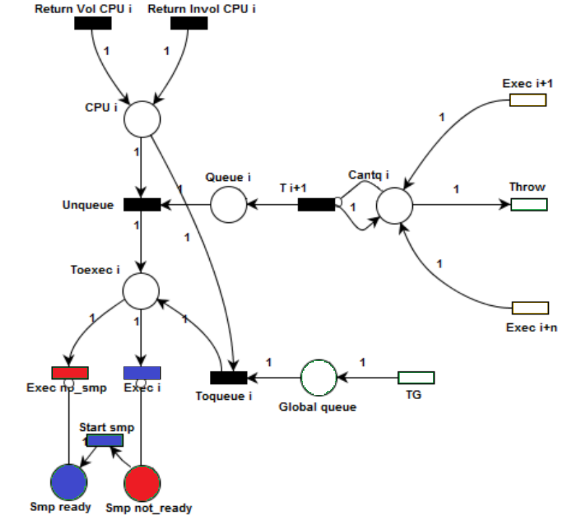
  </a>
  </p>

- Utilizar una **plaza global** para indicar que el sistema se encuentra en modo **monoprocesador (NO SMP)**.
- Utilizar una **plaza global** para indicar que el sistema se encuentra en modo **multiprocesador (SMP)**.
- Emplear una **transición global** entre ambas plazas, la cual se disparará cuando se inicialicen todas las CPU.
- Agregar una **transición de ejecución global** que será utilizada únicamente por la CPU0 cuando el sistema se encuentre en modo monoprocesador y no castigará al resto de las CPU. Notar que esta transición no estará conectada al resto de las CPU del sistema operativo.
- La **transición global de ejecución** es equivalente a la ya existente para cada CPU y tendrá como jerárquica la misma transición `RUNQ ⇒ RUNNING` del hilo.

#### Implementación


1. Añadir en `petri_global_net.c` la transición jerárquica del thread a la transición de ejecución global.


2. Agregar en `petri_global_net.c` el campo `smp_set`, inicializado en 0, el cual va a permitir identificar el momento en que se inició el modo SMP.

<p align="center">
    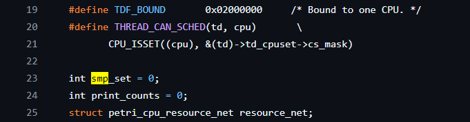
  </a>
  </p>


3. Añadir en la función `resource_fire_net` en `petri_global_net.c` la comprobación del estado SMP del sistema representado por `smp_started`. Cuando `smp_started` se ponga en 1, se debe disparar la transición de traspaso a SMP en la red de recursos y poner en 1 a `smp_set`.

<p align="center">
    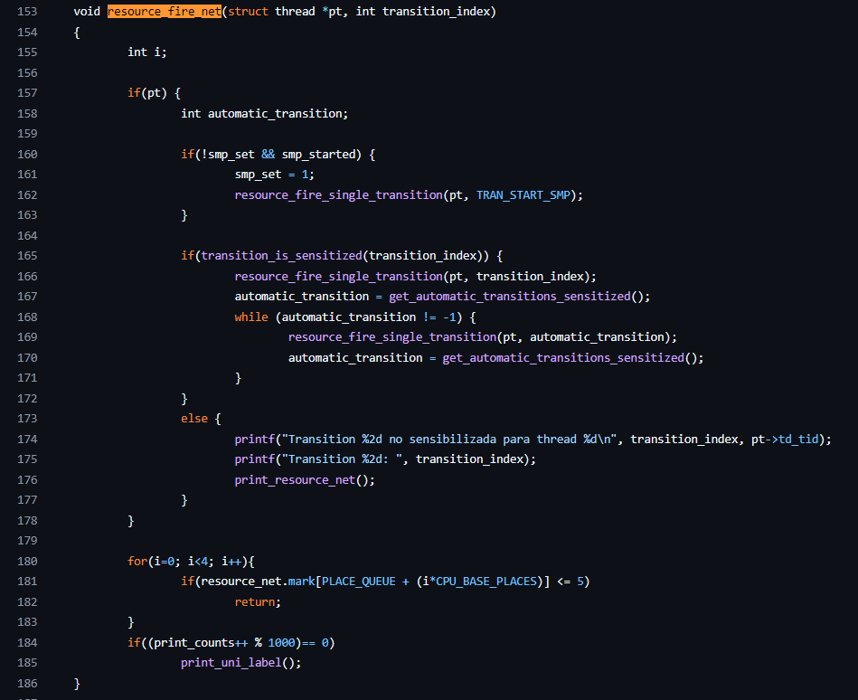
  </a>
  </p>


4. Agregar en `sched_petri.h` la definición de `resource_execute_thread` e implementarla en `petri_global_net.c`:
   - `Resource_execute_thread`: recibe un thread como parámetro y un número de CPU. Esta función ejecuta la transición de ejecución que corresponda, según el valor de `smp_set`.

<p align="center">
    
  </a>
  </p>
<p align="center">
    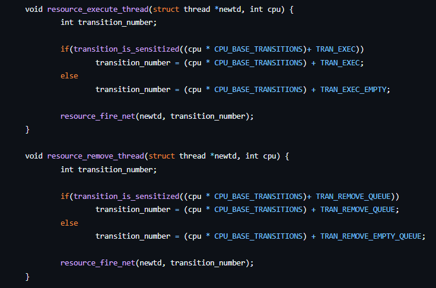
  </a>
  </p>


5. Reemplazar en la función `sched_switch` en `sched_4bsd.c` el disparo de la transición de ejecución por un llamado a `resource_execute_thread`.
6. Modificar la función `resource_choose_cpu` en `petri_global_net.c` para que retorne siempre la transición de encolado global cuando el sistema se encuentre en **NO SMP**.


---

###   Undécima iteración: Expulsión de hilos 📋

Representar la expulsión de un hilo de una determinada cola.   También se buscará representar la expulsión de los hilos del sistema operativo cuando los mismos finalizan su ejecución.


<p align="center">
    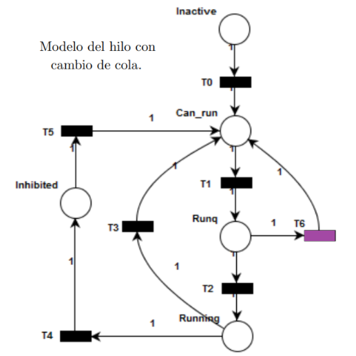
  </a>
  </p>

<p align="center">
    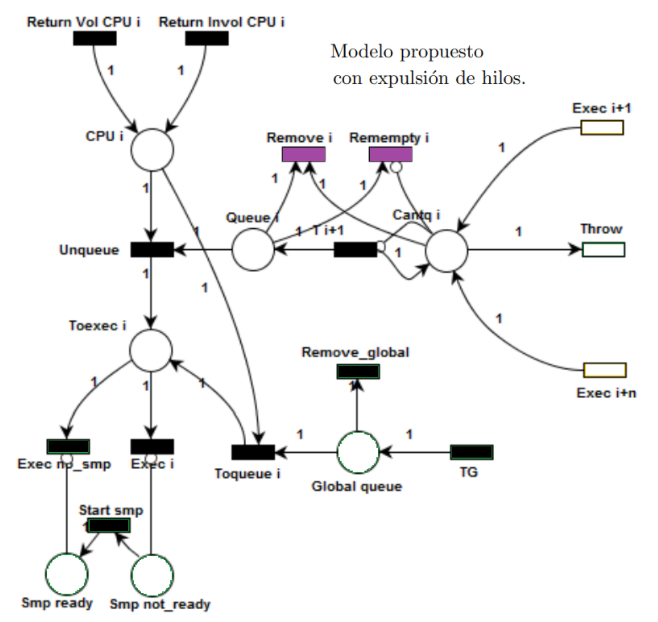
  </a>
  </p>

  En el modelo del hilo se representa un nuevo cambio de estado para el hilo `RUNQ ⇒ CAN RUN`. La transición `T6` se ejecutará cada vez que un hilo deba ser expulsado de la cola en que se encuentra actualmente.

En cuanto al modelo de la red de recursos, para representar la expulsión de los hilos se van a incorporar dos transiciones de expulsión para cada CPU:
- La primera expulsará a un hilo de su cola cada vez que se ejecute y restará un token de habilitación de la CPU, es decir, que se premia a la CPU para tener como jerárquica la transición `RUNQ ⇒ CAN RUN` del hilo.

Este último modelo contempla las siguientes funcionalidades del scheduler:
- Encolado de hilos, ya sea en cola global o de una CPU.
- Expulsión de hilos de una cola, para asignarlos a una correcta.
- Desencolado de hilos cuando se encuentra presente la CPU, ya sea desde la cola global o la de la CPU.
- Ejecución monoprocesador para la `CPU0`.
- Ejecución multiprocesador para todas las CPU.
- Retornos voluntarios e involuntarios de la CPU.
- Transiciones jerárquicas asignadas para la conexión con cada red de hilos que pueda encolar.

La segunda expulsará a un hilo de su cola cada vez que se ejecute y la plaza de habilitación no tenga ningún token.

Por otra parte, se agregó también una transición global de expulsión para cuando el hilo expulsado se encuentre encolado en la cola global, la cual es única ya que no debe premiar el encolado de ninguna CPU.

Para realizar la nueva conexión entre ambas redes, se va a tener que tanto las transiciones de expulsión de cada CPU como la transición de expulsión global...


#### Implementación del modelo


1. Definir en `sched_petri.h` los macros de las nuevas plazas y transiciones incorporadas al modelo. Inicializarlas en `init_resource_net`.

2. Añadir en `petri_global_net.c` la transición jerárquica del thread a las transiciones de remoción de cada CPU y la global.

3. Agregar en `sched_petri.h` la definición de `resource_remove_thread` e implementarla en `petri_global_net.c`:

   - **Resource_remove_thread**: recibe un thread como parámetro y un número de CPU. Esta función ejecuta la transición de expulsión de la CPU que corresponda, según cuál sea la que se encuentre sensibilizada.

4. Identificar dónde se expulsan los threads de su cola en el código fuente. Esto se realiza en `sched_4bsd.c` en la función `sched_rem`.

5. Llamar a `resource_fire_net` en `sched_rem` para expulsar a los threads que se encuentren actualmente en la cola global y deban ser reubicados, o bien llamar a `resource_remove_thread` para expulsar a los threads que se encuentren en una cola de CPU para reubicarlos.

6. Identificar dónde son desechados los threads que finalizan su ejecución en el código fuente. Esto se realiza en `sched_4bsd.c` en la función `sched_throw`.


7. Llamar a `resource_expulse_thread` en `sched_throw` para expulsar a los threads que deben ser desechados. Posteriormente, se debe seleccionar un nuevo thread de la cola y mandarlo a ejecución. Para ello, debe dispararse primero la transición de desencolado, al igual que se hace en `sched_choose`, y posteriormente llamar a `resource_execute_thread` con el thread elegido.

<p align="center">
    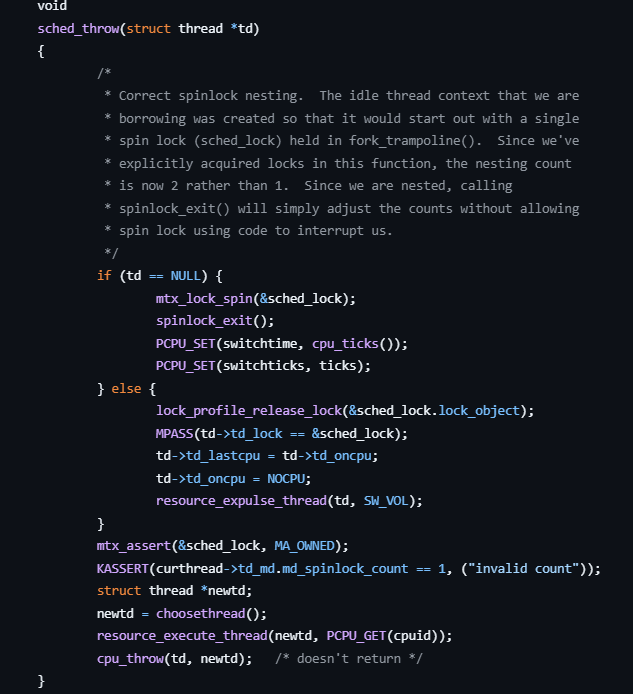
  </a>
  </p>

  #### Análisis de resultados

Luego de probar este último modelo en el código y simularlo, el mismo resultó funcionar como se esperaba tanto para la red de los recursos como para la del thread, cumpliendo el objetivo propuesto para la iteración. Sin embargo, se llevó a cabo un análisis más profundo y se pudieron resaltar algunas falencias en la red de recursos:

1. **Ineficiencia en la penalización de CPUs**: El método propuesto de castigar las CPU que ejecutan más lento resulta poco eficiente cuando hay pocos hilos ejecutándose en el sistema, ya que las colas están en su mayor tiempo vacías y no resulta necesario castigar a CPU inactivas.

2. **Pérdida de control del estado global**: Cuando un hilo pasa a ejecución, se pierde control del estado en que se encuentra la red global. Además, para las transiciones de retorno de CPU no existe ningún mecanismo de control presente en la red global para controlar sus disparos.

Por otra parte, el modelo aún no cubre la funcionalidad del scheduler que permite a hilos que acaban de ser encolados pasar directamente a ejecución cuando su prioridad es mayor al que se encuentra actualmente ejecutando.

---


### Décimo tercera iteración: Hilos de baja prioridad 📋

Se buscará implementar el funcionamiento de los hilos de baja prioridad que pasan a ocupar la CPU cuando la misma no posee ningún hilo para ejecutar en su cola.


<p align="center">
    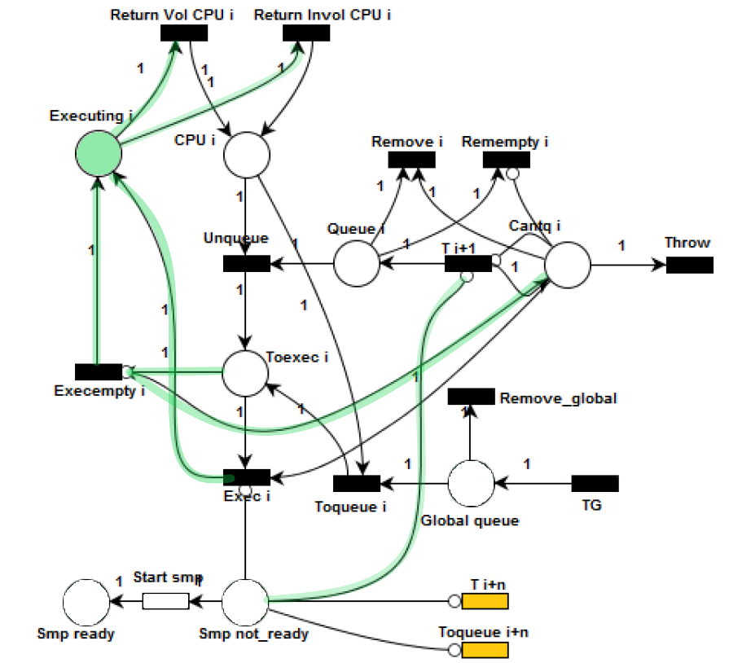
  </a>
  </p>

  Habiendo llegado a este último modelo, se detalla el marcado inicial necesario para asegurar el correcto funcionamiento del *scheduler*, tanto en la red de hilos como en la red de recursos:

- **Red de hilos**: El marcado inicial debe ubicar un token en la plaza *CAN RUN* de cada hilo, ya que cuando el hilo ingresa por primera vez al *scheduler* para ser encolado, ya ha sido inicializado (*INACTIVE → CAN RUN* ejecutado). Sin embargo, hay un hilo especial, con ID `100000`, que es responsable de inicializar al resto. Este hilo comenzará en el estado *RUNNING*, ya que está ejecutándose en la CPU0 desde el inicio.

- **Red de recursos**: La red comenzará con un token en la plaza que indica que el sistema está en modo monoprocesador. Además, las plazas que representan a las CPUs se inicializan con un token, excepto la de la CPU0, que ya está ejecutando el hilo inicial del sistema. Por lo tanto, para la CPU0, el token debe colocarse en la plaza que indica que está en estado de ejecución.

Finalmente, el comportamiento de los hilos de baja prioridad, que ocupan la CPU cuando no hay otros hilos disponibles, se abordará en el análisis de la implementación.


#### Implementación del modelo


1. **Eliminar en `petri_global_net.c` la transición jerárquica del thread a la transición de ejecución descartada**.
   
2. **Inicializar correctamente el marcado de los threads** en `init_petri_thread` de `sched_petri.c`. Notar que esta función, llamada al ser alocado en memoria un nuevo thread, nunca será llamada para el thread0 inicial.

3. **Inicializar correctamente el marcado de la red de recursos** en la función `init_resource_net` de `petri_global_net.c`. Esta función se llamará al inicializar el *scheduler* en `sched_setup` de `sched_4bsd.c`.

4. **Inicializar en la función `sched_init` de `sched_4bsd.c` el marcado del thread0**, función que es ejecutada únicamente por el mismo al inicializar el sistema.

5. **Modificar la función `sched_choose` de `sched_4bsd.c` de la siguiente manera**:
   - Si no se encuentra ningún thread para ejecutar en ninguna de las colas, se ejecutará la transición de encolado global del *idle thread*. Como los *idle threads* no se encuentran en las colas, para no perder el flujo de la red de los mismos, se los encolará "de pasaje" en la cola global.
   - Inmediatamente después del desencolado, ejecutar la transición de desencolado global para finalizar el "pasaje" por la cola global.
   
6. **El tratamiento de los *idle threads* en `sched_switch` será igual al del resto de los threads** en cuanto a pasaje a ejecución y finalización de la misma. Solo no se los tendrá en cuenta a la hora de encolarlos cuando son expulsados de la CPU.

7. **Dado que los *idle threads* también pueden sufrir cambios de contexto** (voluntarios o involuntarios), si `td_frominh` es igual a `1`, se deberá ejecutar la transición del thread que lo saca del estado de inhibido. Esto se realizará antes de encolar y desencolar el *idle thread* en `sched_choose`.


<p align="center">
    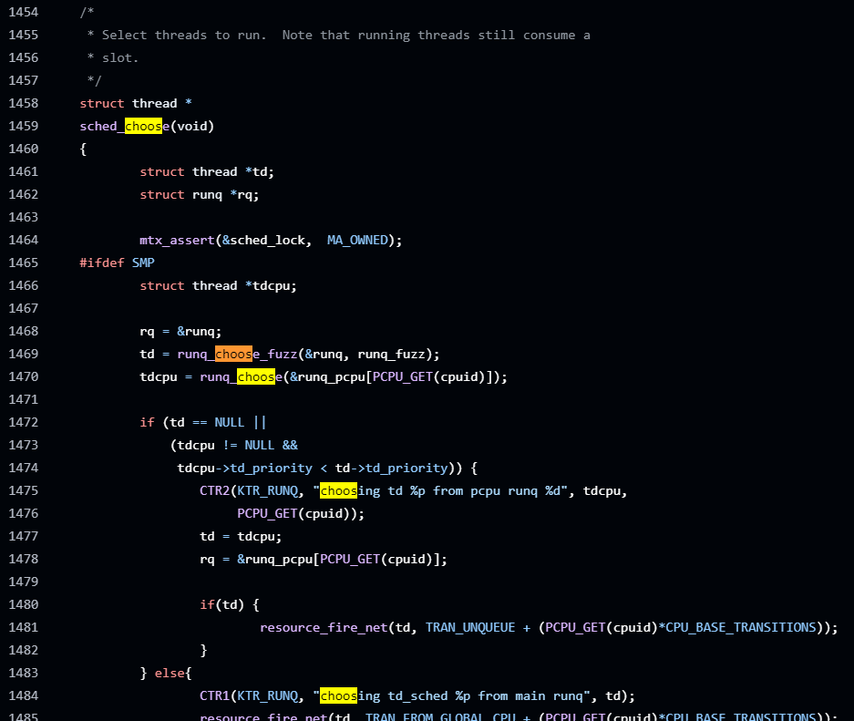
  </a>
  </p>


  #### Análisis de resultados

El resultado esperado en cuanto al funcionamiento de los hilos de baja prioridad fue correcto. Esta nueva incorporación permitió realizar un análisis completo de las redes en ejecución, y los resultados en cuanto al seguimiento de sus marcados fueron los esperados para el modelado del sistema propuesto desde un inicio.

Por otra parte, el agregado de los sistemas de control permitió corroborar en ejecución que las transiciones que controlan son en todo momento correctamente disparadas, sin encontrar momentos donde un hilo intente dispararlas sin encontrarse sensibilizadas.


### MODELO FINAL 📋✅

<p align="center">
    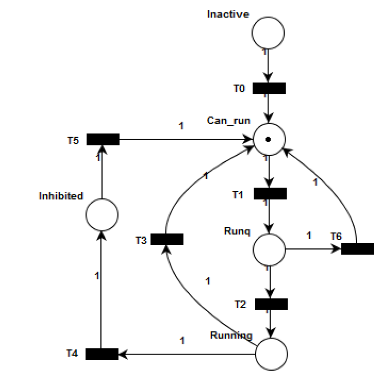
<figcaption>Estados de 1 hilo</figcaption>
    </figure>
  </a>
</p>


<p align="center">
    
<figcaption>Recursos de 1 solo CPU</figcaption>
    </figure>
  </a>
</p>

| **Transición**         | **Descripción**                                                                 | **Condiciones/Acciones/Resultados**                                                      |
|------------------------|---------------------------------------------------------------------------------|------------------------------------------------------------------------------------------|
| **ADDTOQUEUE (Ti+1)**          | Un hilo es agregado a la cola del CPU correspondiente.                         | Inhibida en modo monoprocesador o cuando ya existe un hilo en la cola.                   |
| **UNQUEUE**             | Se quita el hilo próximo a ejecutar de la cola del CPU.                         | El hilo está listo para ser ejecutado.                                                   |
| **EXEC i**                | El hilo pasa a ejecución, ocupando el recurso del procesador.                   | Elimina el token de la plaza de habilitación; inhibida en modo monoprocesador.            |
| **EXECEMPTY i**          | Igual que EXEC, pero no depende de la plaza de habilitación.                    | Usada para hilos provenientes de la cola global.                                         |
| **RETURN VOL CPU i**          | Retorno del procesador para ejecutar otro hilo de su cola.                     | Ocurre cuando el hilo está esperando un evento o recurso.                                |
| **RETURN INVOL CPU i**        | Funciona igual que RETURN VOL.                                                  | Ocurre cuando el hilo agotó su tiempo de CPU o completó su tarea.                        |
| **FROM GLOBAL CPU (TG)**     | Desencolado de un hilo desde la cola global.                                    |                                                                                          |
| **REMOVEQUEUE i**        | Expulsa un hilo de la cola y resta un token de habilitación de la CPU.          | Permite que otro hilo sea encolado.                                                      |
| **REMOVEEMPTYQUEUE i**  | Igual que REMOVE QUEUE, pero se ejecuta sin ningún token en la plaza de habilitación. |                                                                                          |
| **REMOVE_GLOBAL** | Expulsa un hilo de la cola global sin premiar a la CPU.                        |                                                                                          |
| **START SMP**           | Se dispara cuando el sistema pasa de monoprocesador a multiprocesador.          |                                                                                          |
| **THROW**               | Se ejecuta cuando todas las plazas de habilitación de las CPU tienen al menos un token. | Habilita las colas con menor cantidad de hilos que estaban inhibidas.                    |
| **QUEUE GLOBAL**        | Agrega un hilo a la cola global.                                                |                                                                                          |

---


<p align="center">
    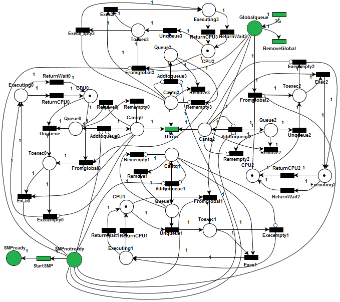
  <figcaption>COMPLETO 4 CPU - Recursos</figcaption>
    </figure>
  </a>
</p>

<p align="center">
    <figure>
      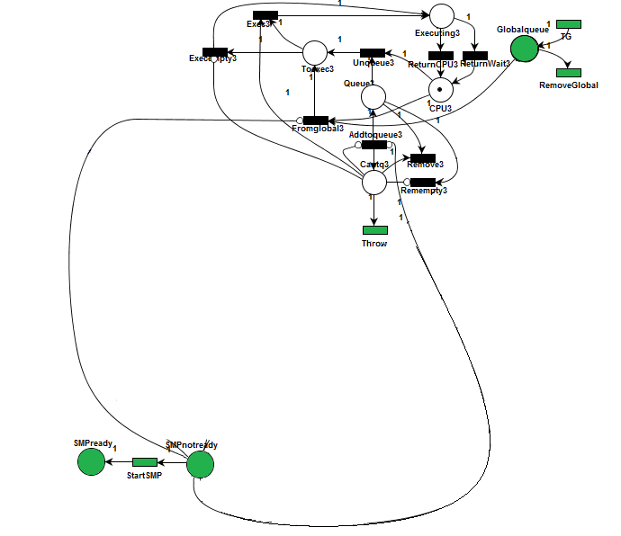
      <figcaption>Camino 1 solo CPU</figcaption>
    </figure>
  </a>
</p>


### Funciones principales

Las funciones principales del scheduler implementado son:

- **sched_add**: se encarga del encolado de los hilos. Hace uso de la función `resource_choose_cpu` para seleccionar la cola. Puede pasar al hilo directamente a ejecución si la función `maybe_preempt` lo determina.

<p align="center">
    <figure>
      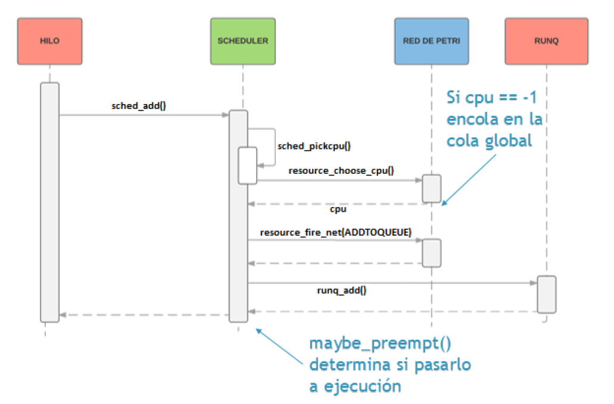
    </figure>
  </a>
</p>

- **sched_choose**: se encarga de desencolar al hilo de mayor prioridad, fijándose tanto en la cola de la CPU actual como en la cola global.

<p align="center">
    <figure>
      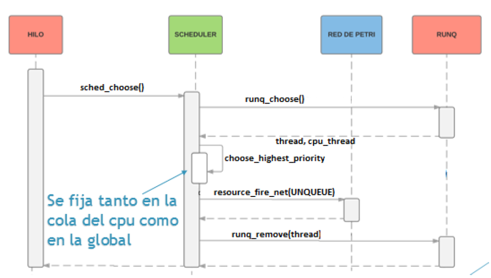
    </figure>
  </a>
</p>


- **sched_rem**: se encarga de remover al hilo de la cola, el cual debe ser reubicado. Hace uso de la función `resource_remove_thread`.

<p align="center">
    <figure>
      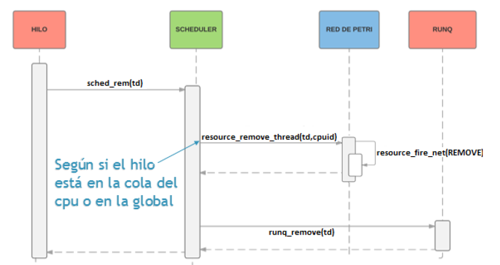
    </figure>
  </a>
</p>


- **sched_switch**: se encarga de expulsar al hilo actual en ejecución haciendo uso de la función `resource_expulse_thread`, reubicarlo en una cola y seleccionar el próximo a ejecutar mediante `choose_thread` para mandarlo a ejecución usando la función `resource_execute_thread`.

<p align="center">
    <figure>
      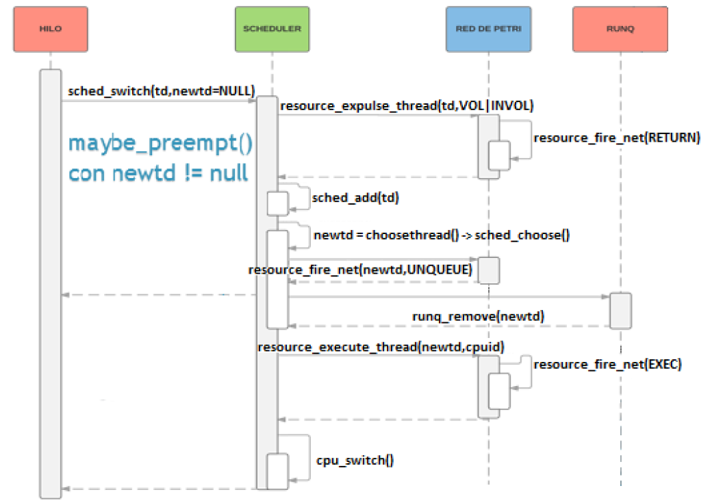
    </figure>
  </a>
</p>

- **sched_throw**: igual a `sched_switch`, con la diferencia de que no reubica en una cola al hilo saliente ya que el mismo ha finalizado su ejecución.

<p align="center">
    <figure>
      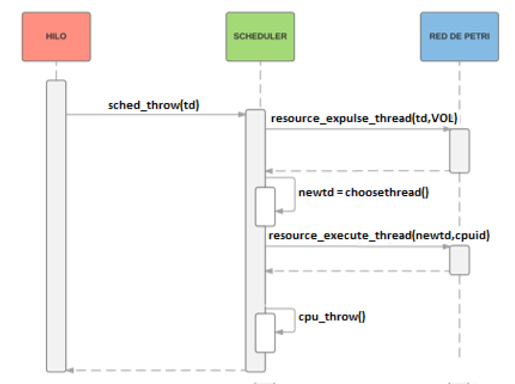
    </figure>
  </a>
</p>


---

# 02-PI-Drudi-Goldman 🚀


## Encolado (add)

El sistema utiliza 64 colas, seleccionando una cola para un hilo determinado dividiendo su prioridad entre 4. Para ahorrar tiempo, los hilos dentro de cada cola no se reorganizan por prioridades. Estas colas pueden ser de los siguientes tipos: **run queue**, **turnstile queue** o **sleep queue**.

- Los hilos en estado **RUNNABLE** se ubican en las **run queue**.
- Los hilos bloqueados o esperando un evento se colocan en las **turnstile queue** o **sleep queue**.

### Comportamiento del sistema

- Si un hilo agota su tiempo permitido, se coloca al final de la cola de la que procede, y el próximo hilo en la cola se selecciona para ejecutarse.
- Si un hilo se bloquea, se coloca en una **turnstile queue** o **sleep queue**, en lugar de regresar a la **run queue**.

### Función `sched_add()`

La operación de encolado se realiza en la función `sched_add()`, que recibe como parámetros el hilo a encolar y algunos flags con información sobre este. Las etapas principales del proceso son las siguientes:

1. **Verificación del estado del hilo**: El hilo debe estar en estado **CAN RUN** o **RUNNING** para ser encolado. Si cumple con esta condición, se adquiere el lock del planificador y el hilo pasa al estado **RUNQ**.
   
2. **Selección de la cola de CPU**: Se utiliza la función `sched_pickcpu()` para elegir el CPU en el cual se encolará el hilo. Este proceso se realiza en varias etapas:
   - Se verifica si el hilo ya había sido ejecutado en un CPU previo. Si es posible, se intenta reencolarlo en el mismo procesador; si no, se asigna el valor **NOCPU** (-1).
   - Se itera sobre cada CPU disponible en el sistema y se verifica si es permitido encolar en dicho CPU.
   - Dependiendo del valor de la variable que indica el CPU previo:
     - Si la variable es **NOCPU**, se asigna el CPU actual de la iteración.
     - Si la variable tiene un CPU asignado, se compara la cantidad de procesos en la cola del CPU actual con el del CPU anterior. Si el CPU actual tiene menos hilos, se selecciona este.
   - Al finalizar la iteración, se retorna el CPU más adecuado para el hilo.

3. **Encolado en la cola del CPU**: Una vez seleccionado el CPU, se realizan los cambios de contexto necesarios para agregar el hilo a la cola del procesador. Si el CPU seleccionado es diferente al CPU en ejecución actual, se envía una señal **IPI** (inter-processor interrupt) para notificar al nuevo CPU sobre el hilo en su cola.

4. **Preemption**: Si el hilo se encola en el CPU actual, se verifica si tiene mayor prioridad que el hilo en ejecución. Si es así, se procede con la **preemptión**, reemplazando al hilo actual con el nuevo.


## Cambios de contexto (switch y throw)

En el sistema, los cambios de contexto de los hilos se gestionan principalmente mediante dos funciones clave: **`sched_switch()`** y **`sched_throw()`**.

### Función `sched_switch()`

Esta función expulsa al hilo que recibe como parámetro, el cual es el hilo actual en ejecución. Si por alguna razón el hilo continúa en estado **RUNNING**, se reencola utilizando la función **`sched_add()`**. El proceso se detalla a continuación:

1. **Expulsión del hilo**: El hilo actual es expulsado y marcado como **NO RUNNING**. Si sigue en estado **RUNNING**, se lo reencola.
   
2. **Selección de un nuevo hilo**: Una vez expulsado el hilo anterior, se utiliza la función **`choosethread()`** junto con **`sched_choose()`** para seleccionar un nuevo hilo de la cola.
   
3. **Cambio de contexto**: Si el hilo seleccionado es diferente al anterior, se procede al cambio de contexto usando la función **`cpu_switch()`**. Esta función guarda el contexto del hilo anterior y restaura el contexto del nuevo hilo. Además, marca el nuevo hilo con el estado **TD_RUNNING**, asegurando que está en ejecución.

### Función `sched_throw()`

La función **`sched_throw()`** realiza un cambio de contexto similar, pero está diseñada para manejar la expulsión de un hilo que ha finalizado su ejecución, y que no necesita ser reubicado en una cola. El proceso es el siguiente:

1. **Expulsión del hilo**: El hilo que recibe como parámetro (que puede ser nulo) es removido del planificador, liberando sus recursos.
   
2. **Selección de un nuevo hilo**: Al igual que en `sched_switch()`, se utiliza **`choosethread()`** para seleccionar un nuevo hilo para ejecutarse en el mismo CPU.

3. **Continuación de la ejecución**: Si se selecciona un nuevo hilo, la ejecución continúa con este nuevo contexto.

Ambas funciones aseguran una correcta gestión de los hilos, manteniendo el estado del sistema y asegurando que siempre haya un hilo listo para ejecutarse.


<p align="center">
    <figure>
      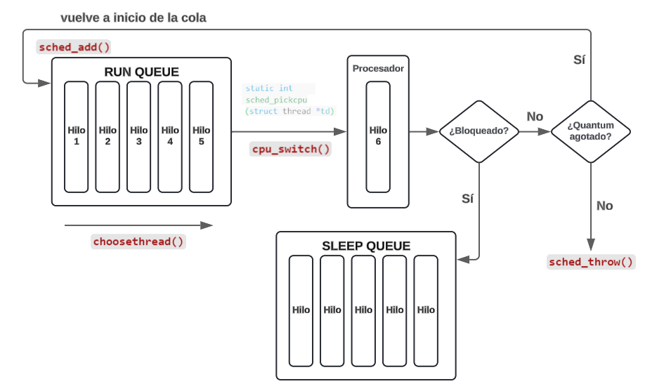
    </figure>
  </a>
</p>

## Elección de hilos (choose)

La elección del próximo hilo a ejecutar se realiza mediante la función **`sched_choose()`**, la cual es invocada por la función **`choosethread()`**.

### Funcionamiento

El objetivo de **`sched_choose()`** es seleccionar el hilo con mayor prioridad disponible para ser ejecutado, eligiéndolo entre las colas del CPU y la cola global. Los hilos en estado **RUNNABLE** son aquellos que están habilitados para ser ejecutados y cada uno tiene una prioridad asignada.

El proceso es el siguiente:

1. **Obtención de hilos**: La función obtiene el primer hilo de la cola global y el primer hilo de la cola del CPU. Estos hilos son almacenados en dos variables separadas.

2. **Comparación de prioridades**: A continuación, se comparan las prioridades de ambos hilos. El hilo con mayor prioridad será el elegido para continuar con la ejecución.

3. **Remoción del hilo**: Una vez seleccionado el hilo de mayor prioridad, este se elimina de su cola correspondiente, ya sea la global o la del CPU.

4. **Caso de colas vacías**: Si ambos hilos son nulos (es decir, si no hay hilos disponibles para ejecutar), se retorna el **idle thread** simulando una ejecución con este hilo.

De esta manera, el sistema garantiza que siempre se elige el hilo más apropiado para ser ejecutado en función de las prioridades y el estado de las colas.


## Remoción de hilos de la cola (rem)

A diferencia de la función **`sched_choose()`**, en la que un hilo es removido de la cola para ser ejecutado, la función **`sched_rem()`** tiene como propósito quitar un hilo (especificado como parámetro) de su cola por dos razones principales:

1. **Ajuste de prioridad**: 
   Si el hilo cambia de prioridad, es necesario removerlo de su cola actual y volver a encolarlo en la posición adecuada según su nueva prioridad. Este proceso se realiza llamando primero a **`sched_rem()`** para quitar el hilo, seguido de **`sched_add()`** para volver a encolarlo en la cola correcta.

2. **Afinidad con CPU**: 
   Cuando un hilo tiene afinidad con un CPU específico, también es necesario removerlo de su cola actual y volver a encolarlo en la cola del CPU correspondiente. Esto asegura que el hilo se ubique en la cola del procesador más adecuado para su ejecución, siguiendo el mismo proceso de remoción y reubicación mencionado anteriormente.

Esta función es fundamental para mantener el orden adecuado de los hilos en el sistema y asegurar que los cambios en las prioridades o afinidades sean gestionados correctamente.

## Remoción de hilos de la cola (rem)

A diferencia de la función **`sched_choose()`**, en la que un hilo es removido de la cola para ser ejecutado, la función **`sched_rem()`** tiene como propósito quitar un hilo (especificado como parámetro) de su cola por dos razones principales:

1. **Ajuste de prioridad**: 
   Si el hilo cambia de prioridad, es necesario removerlo de su cola actual y volver a encolarlo en la posición adecuada según su nueva prioridad. Este proceso se realiza llamando primero a **`sched_rem()`** para quitar el hilo, seguido de **`sched_add()`** para volver a encolarlo en la cola correcta.

2. **Afinidad con CPU**: 
   Cuando un hilo tiene afinidad con un CPU específico, también es necesario removerlo de su cola actual y volver a encolarlo en la cola del CPU correspondiente. Esto asegura que el hilo se ubique en la cola del procesador más adecuado para su ejecución, siguiendo el mismo proceso de remoción y reubicación mencionado anteriormente.

Esta función es fundamental para mantener el orden adecuado de los hilos en el sistema y asegurar que los cambios en las prioridades o afinidades sean gestionados correctamente.

## Modelado del planificador


<p align="center">
    <figure>
      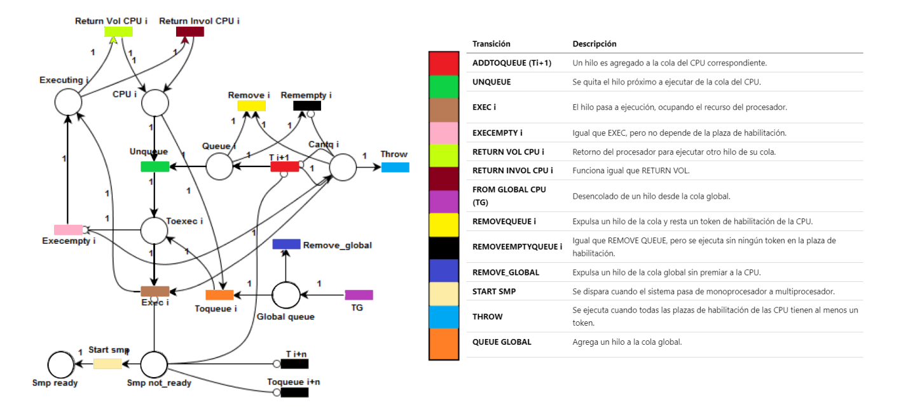
    </figure>
  </a>
</p>


Para conectar las redes de hilos con la red de recursos de las CPU, se emplea el concepto de **redes jerárquicas**. Esto implica que cuando se dispara una transición en la red de recursos, debe dispararse simultáneamente una transición correspondiente en la red del hilo. Esta estructura permite sincronizar y coordinar las acciones entre las diferentes redes, asegurando que el estado de los recursos y los hilos permanezcan alineados. La jerarquía de redes garantiza que las decisiones en la asignación de recursos (como las CPU) afecten directamente el comportamiento de los hilos en ejecución.


<p align="center">
    <figure>
      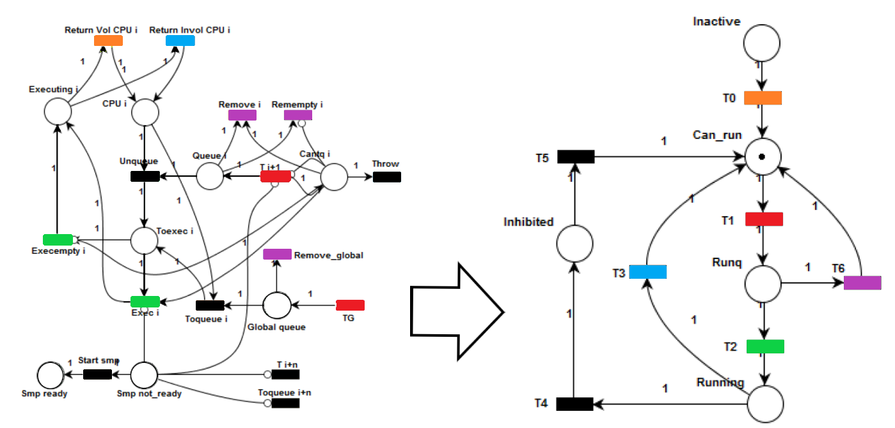
    </figure>
  </a>
</p>


---

# 03-PI-Bonino-Daniele 🚀

## Primera iteración 📋


### Compilación del Kernel

Al tratarse de desarrollo a nivel de kernel, para ver reflejados en el sistema los cambios realizados sobre el código es necesario recompilar el kernel con los archivos nuevos o modificados. Los archivos compilados por el kernel se encuentran dentro del source tree, cuyo path por defecto es `/usr/src/sys/`. Este proceso puede llevar mucho tiempo, por lo que es importante conocerlo a fondo y optimizarlo lo máximo posible.

El primer paso fue reducir el kernel lo más posible, modificando la configuración por defecto para deshabilitar todos los módulos que no se necesitan en las máquinas virtuales. Una vez configurado y compilado este kernel minimalista, se empezó a trabajar en la actualización de los módulos de los proyectos integradores mencionados anteriormente. Para ello, se agregaron los archivos fuente de estos módulos a la configuración del kernel para tenerlos en cuenta durante la compilación.

### Módulos Incorporados

#### Módulo Metadata ELF FreeBSD
Este módulo comprende los siguientes archivos:

- `kern/metadata_elf_reader.c`
- `sys/metadata_elf_reader.h`
- `sys/metadata_payloads.h`

Y modifica los siguientes archivos:

- `kern/imgact_elf.c`
- `kern/kern_exec.c`
- `sys/proc.h`

Este trabajo fue originalmente desarrollado sobre **FreeBSD 12.3**, por lo que las modificaciones realizadas en **FreeBSD 13.2** no trajeron grandes dificultades para adaptar el módulo, ya que no afectaron la funcionalidad de las secciones del código donde se implementa. Por ello, se agregaron solo las líneas y funciones necesarias, se incluyeron en el kernel y se recompiló el sistema.

Una vez compilado el nuevo kernel, se probó su funcionamiento utilizando los plugins **CLang** y **GCC** para insertar metadata en los ejecutables **ELF** y leerla en espacio de kernel.

#### Módulo Petri Net Scheduler
Este módulo comprende los siguientes archivos:

- `kern/petri_global_net.c`
- `sys/petri_global_net.h`
- `kern/sched_petri.c`
- `sys/sched_petri.h`

Y modifica los siguientes archivos:

- `kern/sched_4bsd.c`
- `kern/kern_thread.c`
- `sys/proc.h`

Este proyecto fue desarrollado en **FreeBSD 11**, por lo que debido a los cambios entre versiones, la adaptación a la nueva versión del kernel fue más complicada, ya que algunas funciones del scheduler, modelado con la red de Petri, sufrieron modificaciones en su comportamiento.

La mayor parte del código desarrollado por el equipo se integró en sus respectivos archivos sin dificultad, excepto el código en la función `sched_switch`, que se encarga de expulsar un hilo en ejecución y seleccionar uno nuevo para reemplazarlo.

Una vez compilado el kernel con las modificaciones mencionadas, se comenzó a utilizar el nuevo **scheduler** y se realizaron pruebas para evaluar su comportamiento.


#### Análisis de los Resultados

Luego del proceso de actualización del código de los proyectos integradores a la versión **13.2 de FreeBSD**, se comenzó a utilizar el sistema operativo con el kernel compilado con los nuevos archivos, logrando el objetivo de la iteración. Sin embargo, se observó un problema en el código de selección de núcleos de la CPU en el scheduler modelado con la red de Petri. Este nuevo código modificaba el comportamiento original del scheduler **4BSD**, ignorando la afinidad de los hilos (flags `td_pinned`, `TDF_BOUND` y `TSF_AFFINITY`).

Debido a esto, se decidió regresar al esquema original de selección de núcleos, respetando la afinidad de los hilos, pero tomando las decisiones basadas en el modelo de la red de Petri. Durante este proceso, se experimentaron **kernel panics** de manera constante, por lo que se identificó que el siguiente paso sería resolver este problema.


## Segunda iteración 📋

Solucionar el problema relacionado con el escenario donde el nuevo modelo de scheduler ignoraba la afinidad de los procesos a algún núcleo de la CPU.


---

# 04-PI-Cabrera 💫

## Compilación del Kernel en FreeBSD

El kernel es la interfaz crucial entre el software y el hardware, permitiendo aprovechar eficientemente los recursos del sistema.


<p align="center">
    <figure>
      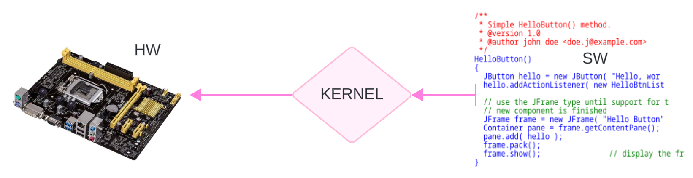
    </figure>
  </a>
</p>


### ¿Por qué usar un kernel personalizado?

Un kernel personalizado ofrece varias ventajas clave, tales como:

- Ajuste preciso al hardware específico que se va a utilizar.
- Creación o adición de nuevos drivers, lo que permite funcionalidades adicionales y modifica el comportamiento del sistema.
- Reducción del tamaño del kernel para equipos con recursos limitados.
- Mejora en el rendimiento general del sistema.

### Kernel Genérico vs Kernel Personalizado

**Kernel Genérico:** Es el kernel predeterminado de FreeBSD, diseñado para soportar una amplia variedad de hardware.


 | **KERNEL PERSONAL**                                       | **KERNEL GENÉRICO**                                   |
|-----------------------------------------------------------|-------------------------------------------------------|
| Agregar nuevos drivers                                    | Gran cantidad de drivers                              |
| Eliminar drivers no usados                                | Funciones básicas                                     |
| Habilitar funciones                                       | No está optimizado                                    |
| Deshabilitar opciones que no usas                         |                                                       |
| Optimizar para mejor rendimiento                          |                                                       |
| Aprender a compilar                                       |                                                       |

#### ¿Por qué personalizar el kernel si el genérico funciona?

Aunque el kernel genérico de FreeBSD suele funcionar bien, personalizar el kernel ofrece varias ventajas clave:

- **Agregar soporte para hardware no incluido**: Puedes añadir drivers específicos para hardware que no está soportado en el kernel genérico.
- **Eliminar drivers innecesarios**: Eliminar soporte para hardware que no utilizas optimiza el uso de recursos y reduce el tamaño del kernel.
- **Habilitar funciones adicionales**: Puedes activar funcionalidades que no están habilitadas en el kernel genérico.
- **Deshabilitar funciones no deseadas**: Desactivar funciones que no necesitas puede mejorar la seguridad y el rendimiento.

Por ejemplo, compilar un kernel para un servidor será muy diferente a hacerlo para un sistema con entorno gráfico. No es lo mismo compilar un kernel para una computadora con 1 GB de RAM y un CPU de un solo núcleo que para una máquina con 64 GB de RAM, un CPU de 8 núcleos y 16 hilos. Adaptar el kernel a tus necesidades permite maximizar el rendimiento y la eficiencia de los recursos disponibles.

#### que necesitamos para compilar el kernel personalizado?

Necesitamos el código fuente en el sistema. 

<p align="center">
    <figure>
      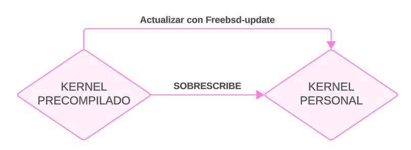
    </figure>
  </a>
</p>

 **Consideraciones al Personalizar el Kernel en FreeBSD**

1. **Configurar `freebsd-update` en la rama RELEASE**: Asegúrate de configurarlo para que no sobrescriba el kernel personalizado, ya que FreeBSD integra el kernel con las funcionalidades y librerías del sistema.
   
2. **Leer el archivo `/usr/src/UPDATING`**: Este archivo contiene información crucial sobre los cambios aplicados en el código fuente. Es importante revisarlo antes de compilar.

3. **Compilar tanto el kernel como el sistema (`world`)**: Si trabajas en las ramas STABLE o CURRENT, deberás compilar ambos cuando realices actualizaciones.

4. **Hacer una copia de seguridad del kernel**: Guarda una copia del kernel genérico o el último kernel que funcionó correctamente antes de realizar modificaciones.

5. **Conservar los archivos de configuración del kernel personalizado**: Estos archivos te permitirán compilar un nuevo kernel con las mismas configuraciones que el kernel anterior.

6. **Compilar varias veces**: Es posible que necesites compilar el kernel varias veces hasta obtener una versión optimizada para tu sistema.

7. **Aprender las diferentes opciones del kernel**: Familiarízate con las opciones disponibles en el kernel para aprovechar al máximo la personalización y optimización.


### Compilar un Kernel personalizado en la rama `RELEASE`

La rama `RELEASE` es la que contiene la herramienta `freebsd-update`, la cual nos permite actualizar el sistema operativo a nivel de parches (nueva versión) utilizando paquetes precompilados.

Al actualizar, hay cuatro áreas principales que se pueden modificar:

1. **Kernel**
2. **World o Espacio de Usuario** (utilidades/librerías)
3. **Doc** (documentación del sistema)
4. **Código fuente de FreeBSD**

Si deseamos modificar el kernel, este debe estar sincronizado con la misma versión de `world` y del código fuente. Para verificar la versión de FreeBSD que estamos utilizando, podemos usar el comando:

```bash
freebsd-version -k
```

Si queremos saber el espacio de usuario o World:

```bash
freebsd-version -u
```

<p align="center">
    <figure>
      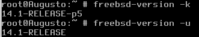
    </figure>
  </a>
</p>

### Instalación y actualización de FreeBSD

Cuando se instala el sistema operativo FreeBSD por primera vez, tenemos la opción de instalar también el código fuente, que se ubica en `usr/src`. Este código se va actualizando con cada `UPDATE`. Sin embargo, no siempre las versiones del kernel y del sistema coinciden, ya que en muchos casos solo se actualiza una parte del sistema.

#### ¿Qué ocurre al actualizar el sistema con un kernel personalizado?

Si combinamos el kernel de mi versión personalizada y luego actualizamos el sistema, pueden ocurrir algunos problemas:

1. **Sobreescritura del kernel**: El kernel precompilado podría sobrescribir mi kernel personalizado.
2. **Desincronización**: Si FreeBSD está configurado para no actualizar el núcleo (`kernel`), podría romperse la sincronización entre el kernel y los archivos del sistema, lo que puede generar errores.

Vamos a explicar esto con un ejemplo práctico. Supongamos que estamos en un sistema con una nueva instalación de FreeBSD de la rama `release` y que el código fuente ya está instalado.

#### Directorio del kernel en FreeBSD

El kernel por defecto siempre se instala en la carpeta `/boot/kernel`. Cuando compilamos e instalamos un nuevo kernel, el directorio actual `/boot/kernel` se renombra y se reserva, dejando `/boot/kernel` para el nuevo núcleo. El cargador de arranque BTX busca automáticamente en la carpeta `/boot` todos los kernels instalados, permitiéndonos elegir con cuál iniciar. Sin embargo, por defecto siempre arrancará con el kernel ubicado en `/boot/kernel`.

#### Comprobación del tamaño del kernel

Podemos verificar el tamaño del kernel que viene con la versión en uso mediante el comando:

`du -sh /boot/kernel`

Esto nos mostrará el tamaño total en megabytes junto con los módulos que están en la misma carpeta. Si deseamos ver el tamaño exacto del archivo del kernel, podemos usar:

`du -sh /boot/kernel/kernel`

En este caso, comprobamos que tiene un tamaño de 15 megabytes.

<p align="center">
  <figure>
    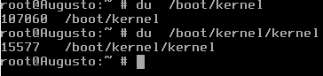
  </figure>
</p>


#### Revisión del archivo UPDATING

Voy a leer el archivo `/usr/src/UPDATING` para verificar si existe alguna indicación especial para compilar el kernel. Vemos que **NO** se informa de nada en particular, tampoco se menciona que FreeBSD ha cambiado el compilador de `gcc` a `clang`. Al final del archivo también se detallan los procedimientos para compilar el kernel o instalarlo, así como para recopilar todo el sistema y verificar su correcto funcionamiento.


 
 
 
 