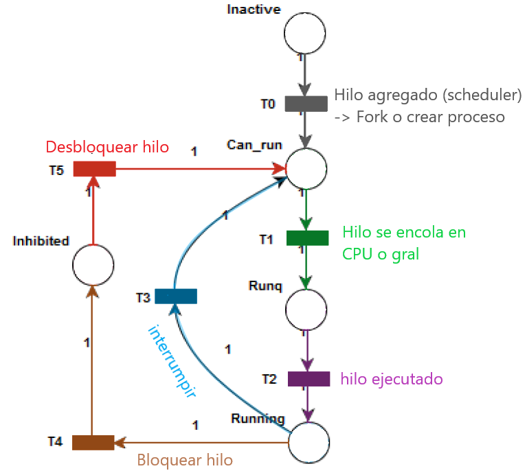

# Notas Proyecto Integrador

## 01-PI-Papp-Turina   🚀   

El modelo propuesto para el desarrollo del trabajo es el **modelo iterativo**. En cada iteración se presentará:

1. Planteo de los **objetivos** que se esperan alcanzar al finalizar la iteración.
2. Propuesta de un nuevo **modelo de redes de Petri** y/o modificaciones al anterior para cubrir los objetivos propuestos.
3. **Explicación detallada** del funcionamiento del modelo propuesto.
4. **Validación** del modelo.
5. **Implementación** del modelo.
6. **Análisis final** en base a los objetivos planteados al inicio de la iteración y los resultados obtenidos.
7. **Pasos a seguir** en la próxima iteración.

---

### Primera iteración: Modelo Inicial 📋 

_En base a los 5 estados que se puede encontrar un hilo se obtiene:_

  
  

T0: El paso del estado `INACTIVE` a `CAN RUN`. Esto sucede cuando el hilo se agrega al scheduler. Esto sucede generalmente en el momento de creación de un proceso o cuando el mismo realiza un fork. Esta tarea no corresponde al scheduler, por lo que inicialmente un hilo en el scheduler se encuentra inicializado en el estado `CAN RUN`. Esta transición nunca se dispara, solo se la incorpora al modelo de modo representativo.

T1: El hilo se pone en una cola local de una determinada CPU o en la cola global dependiendo de la disponibilidad. Esta cola organiza los hilos de acuerdo a sus prioridades de ejecución.

T2: El hilo pasa de la cola ejecutando las instrucciones del programa que tiene asignadas. En este instante el procesador se encuentra ocupado por dicho hilo.

T3: El scheduler interrumpe el hilo y lo vuelve a colocar en una cola. El planificador toma otro hilo de la cola (el de mayor prioridad) y realiza un cambio de contexto.

T4: Algún evento, semáforo o espera bloquea al hilo. Se agrega en una `sleepq` o `turnstile`, en la cual el hilo queda a la espera de un evento que le quitará el bloqueo.

T5: Se desbloquea el hilo y puede volver a encolarse nuevamente. El evento que lo desbloquea se genera fuera del scheduler. El hilo queda a la espera para poder cambiar de estado cuando corresponda.

